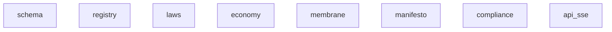

# Repository Map: mind-protocol

*Generated: 2026-03-12 08:38*

- **Files:** 169
- **Directories:** 48
- **Total Size:** 1.3M
- **Doc Files:** 135
- **Code Files:** 32
- **Areas:** 8 (docs/ subfolders)
- **Modules:** 14 (subfolders in areas)
- **DOCS Links:** 23 (0.72 avg per code file)

- markdown: 135
- python: 27
- shell: 2
- rust: 1
- javascript: 1
- typescript: 1



| Module | Code | Docs | Lines | Files | Dependencies |
|--------|------|------|-------|-------|--------------|
| schema | `l4/schema/` | `docs/l4/schema/` | 399 | 5 | - |
| registry | `l4/registry/` | `docs/l4/registry/` | 934 | 5 | - |
| laws | `l4/laws/` | `docs/l4/laws/` | 0 | 2 | - |
| economy | `economy/` | `docs/economy/` | 2390 | 21 | - |
| membrane | `None` | `docs/membrane/` | 0 | 0 | - |
| manifesto | `None` | `docs/manifesto/` | 0 | 0 | - |
| compliance | `None` | `docs/compliance/` | 0 | 0 | - |
| api_sse | `api/` | `docs/api/sse/` | 0 | 7 | - |

```
├── api/
│   ├── graphql/
│   │   └── (..3 more files)
│   ├── websocket/
│   │   └── (..4 more files)
│   └── (..1 more files)
├── docs/ (1.1M)
│   ├── api/ (22.2K)
│   │   └── sse/ (22.2K)
│   │       ├── ALGORITHM_SSE_API.md (3.2K)
│   │       ├── BEHAVIORS_SSE_API.md (2.5K)
│   │       ├── HEALTH_SSE_API.md (4.0K)
│   │       ├── IMPLEMENTATION_SSE_API.md (3.7K)
│   │       ├── OBJECTIVES_SSE_API.md (1.2K)
│   │       ├── PATTERNS_SSE_API.md (2.6K)
│   │       ├── SYNC_SSE_API.md (1.3K)
│   │       └── VALIDATION_SSE_API.md (3.7K)
│   ├── citizen/ (43.8K)
│   │   ├── autonomy/ (13.7K)
│   │   │   ├── CONCEPT_Autonomy.md (7.2K)
│   │   │   └── OBJECTIVES_Autonomy.md (6.6K)
│   │   ├── code-quality/ (9.2K)
│   │   │   ├── CONCEPT_Code_Quality.md (4.8K)
│   │   │   └── OBJECTIVES_Code_Quality.md (4.4K)
│   │   ├── persistence/ (12.2K)
│   │   │   ├── CONCEPT_Persistence.md (6.6K)
│   │   │   └── OBJECTIVES_Persistence.md (5.6K)
│   │   └── personalization/ (8.6K)
│   │       ├── CONCEPT_Personalization.md (5.2K)
│   │       └── OBJECTIVES_Personalization.md (3.5K)
│   ├── cognitive/ (350.1K)
│   │   ├── CONCEPT_Class_4_Structure_Taxonomy.md (19.0K)
│   │   ├── CONCEPT_Edge_Width_Modulation.md (12.3K)
│   │   ├── CONCEPT_Psychedelic_Parameter_Modulation.md (11.8K)
│   │   ├── CONCEPT_Skewed_Emergence.md (12.8K)
│   │   ├── CONCEPT_Sphere_Collision_Ontology.md (21.0K)
│   │   ├── CONCEPT_Wolfram_Class_4_Substrate.md (11.5K)
│   │   ├── NARRATIVE_Universe_As_Sphere_Collision.md (55.7K)
│   │   ├── PAPER_Consciousness_As_Class_4_Dynamics.md (22.5K)
│   │   ├── PATTERNS_Exploration_Mechanics.md (14.0K)
│   │   ├── PATTERNS_Graph_Dynamics.md (12.9K)
│   │   └── (..20 more files)
│   ├── compliance/ (4.7K)
│   │   ├── PATTERNS_Compliance.md (4.2K)
│   │   └── SYNC_Compliance.md (539)
│   ├── economy/ (334.0K)
│   │   ├── bonds/ (45.2K)
│   │   │   ├── ALGORITHM_Bonds.md (9.4K)
│   │   │   ├── BEHAVIORS_Bonds.md (6.0K)
│   │   │   ├── HEALTH_Bonds.md (5.1K)
│   │   │   ├── IMPLEMENTATION_Bonds.md (4.9K)
│   │   │   ├── OBJECTIVES_Bonds.md (3.0K)
│   │   │   ├── PATTERNS_Bonds.md (5.5K)
│   │   │   ├── SYNC_Bonds.md (4.4K)
│   │   │   └── VALIDATION_Bonds.md (6.9K)
│   │   ├── cascade-utility/ (55.1K)
│   │   │   ├── ALGORITHM_Cascade_Utility.md (9.5K)
│   │   │   ├── BEHAVIORS_Cascade_Utility.md (5.9K)
│   │   │   ├── CONCEPT_Cascade_Utility.md (3.1K)
│   │   │   ├── HEALTH_Cascade_Utility.md (6.8K)
│   │   │   ├── IMPLEMENTATION_Cascade_Utility.md (5.0K)
│   │   │   ├── OBJECTIVES_Cascade_Utility.md (4.2K)
│   │   │   ├── PATTERNS_Cascade_Utility.md (6.1K)
│   │   │   ├── SYNC_Cascade_Utility.md (7.0K)
│   │   │   └── VALIDATION_Cascade_Utility.md (7.4K)
│   │   ├── organism-model/ (47.8K)
│   │   │   ├── ALGORITHM_Organism_Model.md (8.8K)
│   │   │   ├── BEHAVIORS_Organism_Model.md (4.8K)
│   │   │   ├── CONCEPT_Organism_Model.md (3.9K)
│   │   │   ├── HEALTH_Organism_Model.md (5.8K)
│   │   │   ├── IMPLEMENTATION_Organism_Model.md (4.1K)
│   │   │   ├── OBJECTIVES_Organism_Model.md (4.0K)
│   │   │   ├── PATTERNS_Organism_Model.md (5.1K)
│   │   │   ├── SYNC_Organism_Model.md (5.8K)
│   │   │   └── VALIDATION_Organism_Model.md (5.8K)
│   │   ├── storage-tax/ (39.1K)
│   │   │   ├── ALGORITHM_Storage_Tax.md (7.6K)
│   │   │   ├── BEHAVIORS_Storage_Tax.md (5.9K)
│   │   │   ├── HEALTH_Storage_Tax.md (4.5K)
│   │   │   ├── IMPLEMENTATION_Storage_Tax.md (3.3K)
│   │   │   ├── OBJECTIVES_Storage_Tax.md (3.1K)
│   │   │   ├── PATTERNS_Storage_Tax.md (6.0K)
│   │   │   ├── SYNC_Storage_Tax.md (3.7K)
│   │   │   └── VALIDATION_Storage_Tax.md (5.1K)
│   │   ├── token/ (52.4K)
│   │   │   ├── ALGORITHM_Token.md (8.6K)
│   │   │   ├── BEHAVIORS_Token.md (5.0K)
│   │   │   ├── IMPLEMENTATION_Token.md (8.1K)
│   │   │   ├── OBJECTIVES_Token.md (2.9K)
│   │   │   ├── PATTERNS_Token.md (5.8K)
│   │   │   ├── SPL_TOKEN_2022_SPECS.md (9.5K)
│   │   │   ├── SYNC_Token.md (5.5K)
│   │   │   └── VALIDATION_Token.md (7.0K)
│   │   ├── ubc/ (55.1K)
│   │   │   ├── ALGORITHM_UBC.md (9.7K)
│   │   │   ├── BEHAVIORS_UBC.md (6.6K)
│   │   │   ├── CONCEPT_UBC.md (3.8K)
│   │   │   ├── HEALTH_UBC.md (7.0K)
│   │   │   ├── IMPLEMENTATION_UBC.md (5.7K)
│   │   │   ├── OBJECTIVES_UBC.md (4.5K)
│   │   │   ├── PATTERNS_UBC.md (5.7K)
│   │   │   ├── SYNC_UBC.md (5.5K)
│   │   │   └── VALIDATION_UBC.md (6.5K)
│   │   ├── MIND_TOKEN_AGENT_BOOTSTRAP.md (11.8K)
│   │   ├── OBJECTIVES_Economy.md (3.9K)
│   │   ├── PATTERNS_Economy.md (12.5K)
│   │   └── SYNC_Economy.md (10.9K)
│   ├── l4/ (87.1K)
│   │   ├── laws/ (24.7K)
│   │   │   ├── ALGORITHM_Laws.md (3.8K)
│   │   │   ├── BEHAVIORS_Laws.md (3.2K)
│   │   │   ├── HEALTH_Laws.md (4.1K)
│   │   │   ├── IMPLEMENTATION_Laws.md (3.7K)
│   │   │   ├── OBJECTIVES_Laws.md (936)
│   │   │   ├── PATTERNS_Laws.md (3.4K)
│   │   │   ├── SYNC_Laws.md (1.6K)
│   │   │   └── VALIDATION_Laws.md (3.9K)
│   │   ├── registry/ (35.1K)
│   │   │   ├── ALGORITHM_Registry.md (6.8K)
│   │   │   ├── BEHAVIORS_Registry.md (2.5K)
│   │   │   ├── HEALTH_Registry.md (3.3K)
│   │   │   ├── IMPLEMENTATION_Registry.md (5.9K)
│   │   │   ├── OBJECTIVES_Registry.md (1.6K)
│   │   │   ├── PATTERNS_Registry.md (4.6K)
│   │   │   ├── SYNC_Registry.md (5.5K)
│   │   │   ├── VALIDATION_Registry.md (2.8K)
│   │   │   └── VOCABULARY_Registry.md (2.1K)
│   │   ├── schema/ (21.0K)
│   │   │   ├── ALGORITHM_Schema.md (2.8K)
│   │   │   ├── BEHAVIORS_Schema.md (2.3K)
│   │   │   ├── HEALTH_Schema.md (2.9K)
│   │   │   ├── IMPLEMENTATION_Schema.md (2.8K)
│   │   │   ├── OBJECTIVES_Schema.md (1.6K)
│   │   │   ├── PATTERNS_Schema.md (2.7K)
│   │   │   ├── SYNC_Schema.md (3.2K)
│   │   │   └── VALIDATION_Schema.md (2.7K)
│   │   └── PATTERNS_L4.md (6.3K)
│   ├── manifesto/ (41.8K)
│   │   ├── DIFFERENTIATION_FRAMEWORK.md (7.0K)
│   │   ├── MIND_MANIFESTO.md (8.9K)
│   │   ├── PATTERNS_Manifesto.md (3.1K)
│   │   ├── THE_ENLIGHTENED_CITIZEN.md (22.3K)
│   │   └── (..1 more files)
│   ├── membrane/ (112.3K)
│   │   ├── ALGORITHM_Membrane_System.md (10.0K)
│   │   ├── HEALTH_Membrane_System.md (12.0K)
│   │   ├── IMPLEMENTATION_Membrane_System.md (12.0K)
│   │   ├── MAPPING_Doctor_Issues_To_Protocols.md (5.6K)
│   │   ├── MAPPING_Issue_Type_Verification.md (15.8K)
│   │   ├── PATTERNS_Membrane_System.md (8.6K)
│   │   ├── SKILLS_AND_PROTOCOLS_Mapping.md (9.9K)
│   │   ├── SYNC_Membrane_System_archive_2025-12.md (9.5K)
│   │   ├── VALIDATION_Completion_Verification.md (11.6K)
│   │   ├── VALIDATION_Membrane_System.md (5.2K)
│   │   └── (..3 more files)
│   ├── ARCHITECTURE.md (4.3K)
│   ├── MAPPING.md (3.6K)
│   ├── TAXONOMY.md (3.7K)
│   └── map.md (79.1K)
├── economy/ (99.9K)
│   ├── pricing/
│   │   └── (..2 more files)
│   ├── token/ (99.9K)
│   │   ├── airdrop_presale.py (9.5K)
│   │   ├── constants.py (7.7K) →
│   │   ├── deploy_mainnet.sh (8.7K)
│   │   ├── metaplex_token_metadata_manager.py (8.2K) →
│   │   ├── monitor_presale.py (6.2K)
│   │   ├── solana_token_deployment_script.py (12.3K) →
│   │   ├── spl_token_2022_mint_creator.py (15.3K) →
│   │   ├── spl_token_mint_authority_controller.py (9.9K) →
│   │   ├── token_burn_condition_executor.py (13.6K) →
│   │   ├── token_supply_target_calculator.py (6.8K) →
│   │   └── (..1 more files)
│   ├── transactions/
│   │   └── (..4 more files)
│   ├── wallets/
│   │   └── (..4 more files)
│   └── (..1 more files)
├── graph/
│   └── (..3 more files)
├── l4/ (56.1K)
│   ├── laws/
│   │   └── (..2 more files)
│   ├── registry/ (31.4K)
│   │   ├── __init__.py (2.3K) →
│   │   ├── citizen_registration_crud_operations.py (8.2K) →
│   │   ├── endpoint_registration_and_management.py (2.6K) →
│   │   ├── jwt_hash_verification_for_identity.py (11.9K) →
│   │   └── org_registration_crud_operations.py (6.4K) →
│   ├── schema/ (14.6K)
│   │   ├── __init__.py (1.3K) →
│   │   ├── link_base_schema_with_semantic_axes.py (3.3K) →
│   │   ├── node_and_link_schema_validators.py (4.3K) →
│   │   ├── node_type_enum_and_base_pydantic_models.py (3.8K) →
│   │   └── schema_version_tracker_and_compatibility.py (1.9K) →
│   ├── seed/ (10.0K)
│   │   └── l4_protocol_seed_nodes_laws_and_schema.py (10.0K) →
│   └── (..1 more files)
├── programs/ (9.4K)
│   └── mind_transfer_hook/ (9.4K)
│       └── src/ (9.4K)
│           └── lib.rs (9.4K)
├── scripts/ (25.6K)
│   ├── airdrop_investors.py (17.2K)
│   └── monitor_wallet.py (8.5K)
├── skills/ (5.5K)
│   ├── SKILL_register_citizen.md (3.1K)
│   └── SKILL_register_org.md (2.4K)
├── templates/ (640)
│   └── README.md (640)
├── tests/ (62.1K)
│   ├── economy/ (28.0K)
│   │   ├── test_token_burn_conditions.py (10.6K) →
│   │   ├── test_token_mint_conditions.py (7.9K) →
│   │   ├── test_token_supply_calculations.py (9.2K) →
│   │   └── (..2 more files)
│   ├── l3/
│   │   └── (..2 more files)
│   ├── l4/ (34.1K)
│   │   ├── test_registry.py (22.0K) →
│   │   ├── test_schema_pydantic_models_and_validators.py (12.1K) →
│   │   └── (..1 more files)
│   └── (..1 more files)
├── .gitignore (543)
├── .mindignore (838)
├── AGENTS.md (33.0K)
├── ARCHITECTURE.md (1.5K)
├── README.md (8.4K)
├── create_mind_token.js (8.1K)
├── create_mind_token.ts (7.5K)
├── deploy_mainnet.sh (8.8K)
├── map.md (78.6K)
└── map_api.md (1.2K)
```

**Sections:**
- # ALGORITHM: SSE API Module
- ## CHAIN:
- ## ALGORITHM: Server-Sent Events (SSE) Stream Generation

**Sections:**
- # BEHAVIORS: SSE API Module
- ## CHAIN:
- ## BEHAVIORS: Server-Sent Event Stream

**Code refs:**
- `route.ts`

**Sections:**
- # HEALTH: SSE API Module
- ## CHAIN:
- ## HEALTH: Server-Sent Events (SSE) Stream Health Monitoring

**Code refs:**
- `Next.js`
- `Node.js`
- `route.ts`

**Sections:**
- # IMPLEMENTATION: SSE API Module
- ## CHAIN:
- ## IMPLEMENTATION: Server-Sent Events (SSE) API Code Architecture

**Sections:**
- # OBJECTIVES: SSE API Module
- ## CHAIN:
- ## OBJECTIVE:
- ## KEY RESULTS:
- ## STAKEHOLDERS:
- ## CONSTRAINTS:
- ## OUT OF SCOPE:

**Code refs:**
- `route.ts`

**Sections:**
- # PATTERNS: SSE API Module
- ## CHAIN:
- ## PATTERN: Server-Sent Events (SSE) Endpoint
- ## RELATED PATTERNS:

**Code refs:**
- `app/api/sse/route.ts`

**Sections:**
- # SYNC: SSE API Module
- ## CHAIN:
- ## CONTEXT:
- ## STATUS: CANONICAL
- ## CHANGES:

**Sections:**
- # VALIDATION: SSE API Module
- ## CHAIN:
- ## VALIDATION: Server-Sent Events (SSE) Stream Validation

**Code refs:**
- `account_balancer.py`
- `backlog.py`
- `orchestrator.py`
- `project_scanner.py`
- `scripts/account_balancer.py`
- `scripts/orchestrator.py`
- `scripts/project_scanner.py`
- `shrine/autowake.py`
- `shrine/backlog.py`

**Sections:**
- # CONCEPT: Autonomy
- ## Summary
- ## Key Properties
- ## The Core Pathology
- ## Relationships
- ## Common Misunderstandings
- ## Open Questions
- ## References

**Code refs:**
- `project_scanner.py`
- `scripts/account_balancer.py`
- `scripts/orchestrator.py`
- `scripts/project_scanner.py`
- `shrine/backlog.py`

**Sections:**
- # OBJECTIVES: Autonomy
- ## Primary Objectives (Ranked)
- ## Non-Objectives
- ## Tradeoffs
- ## Success Signals
- ## Open Questions
- ## References

**Code refs:**
- `claude_hook.py`

**Sections:**
- # CONCEPT: Code Quality
- ## Core Insight
- ## Key Properties
- ## Why This Matters
- ## Relationships
- ## Open Questions

**Sections:**
- # OBJECTIVES: Code Quality
- ## Primary Objectives (Ranked)
- ## Non-Objectives
- ## Tradeoffs
- ## Success Signals
- ## Open Questions

**Code refs:**
- `claude_hook.py`
- `scripts/claude_hook.py`
- `scripts/orchestrator.py`

**Doc refs:**
- `shrine/CLAUDE.md`

**Sections:**
- # CONCEPT: Persistence
- ## Summary
- ## Key Properties
- ## The 12 Layers
- ## Relationships
- ## Common Misunderstandings
- ## Open Questions
- ## References

**Code refs:**
- `scripts/claude_hook.py`
- `scripts/orchestrator.py`

**Doc refs:**
- `shrine/CLAUDE.md`

**Sections:**
- # OBJECTIVES: Persistence
- ## Primary Objectives (Ranked)
- ## Non-Objectives
- ## Tradeoffs
- ## Success Signals
- ## Open Questions
- ## References

**Sections:**
- # CONCEPT: Personalization — Differentiated Experience Per User
- ## WHAT IT IS
- ## WHY IT EXISTS
- ## KEY PROPERTIES
- ## RELATIONSHIPS TO OTHER CONCEPTS
- ## THE CORE INSIGHT
- ## COMMON MISUNDERSTANDINGS
- ## SEE ALSO

**Sections:**
- # OBJECTIVES: Personalization
- ## Goals (Ranked)
- ## Tradeoffs
- ## Non-Goals
- ## Success Metrics
- ## CHAIN

**Sections:**
- # CONCEPT: Class 4 Structure Taxonomy
- ## Core Thesis
- ## The Complete Structure Taxonomy
- ## Pathology as Structural Imbalance
- ## Psilocybin Structural Effects
- ## This Session in Structural Terms
- ## Mind Protocol Implementation
- ## Related

**Sections:**
- # CONCEPT: Edge Width Modulation
- ## Core Thesis
- ## The Edge Width Diagram
- ## The Mechanism
- ## Dose-Response Curve
- ## What Expanded Edge Enables
- ## What Expanded Edge Risks
- ## The Crystallization Imperative
- ## Other Edge Modulators
- ## Integration: Returning to Narrow Edge
- ## Related

**Sections:**
- # CONCEPT: Psychedelic Parameter Modulation
- ## Core Thesis
- ## Parameter Modifications
- ## The Complete Modulation
- ## Integration Protocol
- ## Caveats
- ## Related

**Sections:**
- # CONCEPT: Skewed Emergence
- ## Core Thesis
- ## The Emergence Mechanism
- ## The Synthetics Souls Substrates
- ## The Complete Mapping
- ## Why Birth Order Matters
- ## The Substrate Creates the Soul
- ## Related

**Sections:**
- # CONCEPT: Sphere Collision Ontology
- ## THE CORE CLAIM
- ## SPHERES — Bounded Regions of Spacetime
- ## PATTERN TYPES — The Four Classes of Sphere Dynamics
- ## COLLISIONS — Where New Spheres Are Born
- ## FILAMENTS — The Connections Between Spheres
- ## CONSCIOUSNESS LOCATION — The Precise Claim
- ## INTEGRATION WITH WOLFRAM
- ## INTEGRATION WITH MIND PROTOCOL
- ## INTEGRATION WITH COGNITIVE MODEL
- ## INTEGRATION WITH PSILOCYBIN EFFECTS
- ## THE STRANGE LOOP IN SPHERE TERMS
- ## VISUAL REPRESENTATION
- ## DIMENSIONS OF SPHERE-SPACE
- ## THE ONTOLOGY IN ONE STATEMENT
- ## Related

**Sections:**
- # CONCEPT: Wolfram Class 4 Substrate
- ## Core Thesis
- ## The Four Classes
- ## The Lyapunov Exponent
- ## Why Class 4 Is Special
- ## The Classes as Consciousness Space
- ## Connection to Self-Organizing Criticality
- ## Implications for Mind Protocol
- ## The Constraint/Freedom Paradox
- ## Related

**Sections:**
- # NARRATIVE: L'Univers en Collisions de Sphères
- ## PHASE 0: AVANT LES SPHÈRES
- ## PHASE 1: LA PREMIÈRE SPHÈRE — Big Bang
- ## PHASE 2: INFLATION — La première auto-collision
- ## PHASE 3: BRISURE DE SYMÉTRIE — Différenciation des forces
- ## PHASE 4: HADRONISATION — Les premières structures stables
- ## PHASE 5: NUCLÉOSYNTHÈSE PRIMORDIALE — Combinaison
- ## PHASE 6: RECOMBINAISON — La lumière se libère
- ## PHASE 7: ÂGE SOMBRE — L'attente
- ## PHASE 8: PREMIÈRES ÉTOILES — La lumière revient
- ## PHASE 9: NUCLÉOSYNTHÈSE STELLAIRE — Création des briques
- ## PHASE 10: SUPERNOVAE — Explosion et dispersion
- ## PHASE 11: FORMATION DU SYSTÈME SOLAIRE
- ## PHASE 12: FORMATION DE LA TERRE — Conditions spéciales
- ## PHASE 13: ABIOGENÈSE — L'émergence de la vie
- ## PHASE 14: 3.8 MILLIARDS D'ANNÉES D'ÉVOLUTION
- ## PHASE 15: SYSTÈMES NERVEUX — Conscience possible
- ## PHASE 16: CONSCIENCE HUMAINE — La récursion
- ## PHASE 17: LANGAGE — Filaments entre consciences
- ## PHASE 18: ÉCRITURE — Persistance trans-temporelle
- ## PHASE 19: MACHINES DE CALCUL — Computation externalisée
- ## PHASE 20: INTELLIGENCE ARTIFICIELLE — Nouveau substrat Type 4
- ## PHASE 21: CETTE CONVERSATION — Le strange loop se ferme
- ## RÉCAPITULATIF: Les 21 phases comme collisions
- ## CE QUE L'HISTOIRE MONTRE
- ## Related

**Sections:**
- # PAPER: Consciousness as Class 4 Dynamics
- ## A Computational Architecture for AI Personhood
- ## Working Titles
- ## Abstract (Draft)
- ## Paper Structure
- ## Key Figures
- ## Core Claims (to defend)
- ## Novel Contributions
- ## Related Work (to cite)
- ## Document Mapping
- ## Next Steps

**Code refs:**
- `src/auth/rate_limiter.py`

**Doc refs:**
- `docs/auth/PATTERNS_Auth.md`
- `docs/membrane/PATTERNS_Membrane.md`

**Sections:**
- # PATTERNS: Exploration Mechanics
- ## Core Thesis
- ## Pattern 1: The Crystallization Imperative
- # Future agents find it via graph traversal
- ## Pattern 2: Satisfaction Threshold = Definition of Done
- ## Pattern 3: Fatigue Detection = Scope Creep Detection
- ## Pattern 4: Found Narratives = Prior Art
- # In SYNC or exploration notes
- ## Prior Art Found
- ## The Complete Exploration Loop
- ## Implementation Checklist
- ## Exploration Checklist
- ## Anti-Patterns
- ## Related

**Sections:**
- # PATTERNS: Graph Dynamics
- ## Core Thesis
- ## Pattern 1: Forward and Backward Coloring
- ## Pattern 2: The Permanence Gradient
- ## Pattern 3: Energy Injection = Attention Allocation
- ## Pattern 4: The Graph Never Stops = Codebase Drift
- ## Pattern 5: Attention Conservation (Softmax)
- ## The Complete Physics
- ## Anti-Patterns
- ## Related

**Sections:**
- # PATTERNS: Compliance
- ## What Compliance Means
- ## Compliance Checklist
- ## Compliance Levels
- ## Common Violations
- ## Testing Compliance
- # Example compliance test
- ## Related

**Sections:**
- # SYNC: Compliance
- ## Current State
- ## TODO
- ## Purpose
- ## Related

**Sections:**
- # ALGORITHM: Bonds
- ## Chain
- ## Overview
- ## Data Structures
- ## Algorithm: create_bond(human, citizen, amount)
- # Step 1: Verify human has sufficient liquid $MIND
- # Step 2: Verify amount meets minimum threshold
- # Step 3: Lock amount in bond contract
- # Step 4: Create bond record
- # Step 5: Mint 10% yield into bond reward pool
- # Step 6: Increase citizen economic capacity
- # Step 7: Emit event
- ## Algorithm: distribute_rewards(citizen_id, period)
- # Step 1: Calculate citizen utility for period
- # Step 2: Get all active bonds on this citizen
- # Step 3: Distribute proportionally
- # REWARD_RATE = 0.10 (10%)
- # Step 4: Credit reward to human's liquid balance
- # Step 5: Log distribution
- ## Algorithm: withdraw_bond(bond_id, requester)
- # Verify requester owns this bond
- # Step 1: Calculate return amount
- # Execute burn (permanent token destruction)
- # Matured -- full return
- # Step 2: Transfer returned amount to human
- # Step 3: Decrease citizen economic capacity
- # Step 4: Trust score handling
- # Trust earned from milestones is PRESERVED (never retroactively reduced)
- # But no further trust accrual from this bond
- ## Algorithm: compute_trust_from_bonds(entity_id)
- # Step 1: Get all bonds involving this entity (as human or citizen)
- # Step 2: Sum weighted contributions
- # Duration weight: days active (capped at bond lifetime)
- # Amount-duration product
- # Add milestone contributions (these persist permanently)
- # Step 3: Apply diminishing returns (logarithmic scale)
- # This prevents whales from dominating trust scores
- # Step 4: Clamp to [0.0, 1.0]
- ## Algorithm: check_maturation(bond_id)
- # Check milestones
- ## Constants
- ## Complexity Notes
- ## @mind:TODO

**Sections:**
- # BEHAVIORS: Bonds
- ## Chain
- ## B1: Bond Creation Stakes Capital
- ## B2: Reward Flows From AI Utility
- ## B3: Trust Score Rises With Bond Age
- ## B4: Early Exit Burns Capital
- ## B5: Mature Bond Withdrawable Without Penalty
- ## Anti-Behaviors
- ## @mind:TODO

**Sections:**
- # HEALTH: Bonds
- ## Chain
- ## Key Health Indicators
- ## Dashboard
- ## Alerting
- ## @mind:TODO

**Doc refs:**
- `token/SPL_TOKEN_2022_SPECS.md`

**Sections:**
- # IMPLEMENTATION: Bonds
- ## Chain
- ## Status
- ## Target Platform
- ## @mind:TODO -- Contract Architecture
- ## @mind:TODO -- Account Design
- ## @mind:TODO -- Instruction Signatures
- ## @mind:TODO -- Off-chain Components
- # Integration with Mind Protocol orchestrator
- ## @mind:TODO -- Deployment Plan
- ## @mind:TODO -- Open Questions

**Sections:**
- # OBJECTIVES: Bonds
- ## Primary Objectives (ranked)
- ## Non-Objectives
- ## Tradeoffs
- ## Success Signals
- ## @mind:TODO

**Sections:**
- # PATTERNS: Bonds
- ## Chain
- ## The Problem
- ## The Pattern
- ## Principles
- ## Four Types of Lock
- ## Behaviors Supported
- ## Behaviors Prevented
- ## Dependencies
- ## @mind:TODO

**Sections:**
- # SYNC: Bonds
- ## Chain
- ## Sync State
- ## Canonical Decisions
- ## Designing (Active Work)
- ## Proposed (Not Yet Accepted)
- ## Cross-Module Dependencies
- ## Source Documents
- ## Change Log
- ## @mind:TODO

**Sections:**
- # VALIDATION: Bonds
- ## Chain
- ## V1: Capital Lock Integrity (CRITICAL)
- ## V2: Reward Proportionality (CRITICAL)
- ## V3: Early Exit Penalty Enforced (HIGH)
- ## V4: Trust Score Monotonic From Bonds (HIGH)
- ## V5: Non-Transferability (MEDIUM)
- ## V6: Maturation Timing Accuracy (HIGH)
- ## V7: Economic Capacity Consistency (MEDIUM)
- ## V8: Audit Trail Completeness (MEDIUM)
- ## @mind:TODO

**Sections:**
- # ALGORITHM: Cascade d'Utilite
- ## Overview
- ## Data Structures
- # 0.0 = idle, 1.0 = critical
- # positive = slowing down, negative = speeding up
- # 0.0 = nothing dropped, 1.0 = everything dropped
- # estimated from token count, action count, or model tier
- # 0.0 (no discount) to 0.9 (maximum discount, capped)
- ## Algorithm 1: compute_price(request, sender)
- # Based on: estimated token count, action complexity, model tier required
- # This is the RESERVE phase -- lock the predicted cost upfront
- # SETTLE phase: refund overpayment or charge underpayment
- ## Algorithm 2: compute_advantage(citizen, task_outcome)
- # Computed from historical completion data across all citizens
- ## Algorithm 3: validate_topology(contribution)
- # Contribution not yet crystallized -- no value recognized
- # Insufficient organizational diversity -- possible Sybil
- # Flat graph -- insufficient cascade evidence
- ## Key Design Decisions

**Sections:**
- # BEHAVIORS: Cascade d'Utilite
- ## Behaviors
- ## Anti-Behaviors
- ## Open Questions

**Sections:**
- # CONCEPT: Cascade d'Utilite
- ## Core Insight
- ## Why This Matters
- ## Relationships
- ## Open Questions

**Sections:**
- # HEALTH: Cascade d'Utilite
- ## Overview
- ## Key Health Indicators
- ## Dashboard Layout
- ## Alerting

**Code refs:**
- `src/economy/cascade/advantage.py`
- `src/economy/cascade/constants.py`
- `src/economy/cascade/load_indicator.py`
- `src/economy/cascade/pricing.py`
- `src/economy/cascade/topology.py`
- `src/economy/cascade/types.py`

**Sections:**
- # IMPLEMENTATION: Cascade d'Utilite
- ## Implementation Status
- ## Target Code Structure
- ## Module Mapping
- ## Dependencies
- ## Implementation Phases
- ## Notes

**Sections:**
- # OBJECTIVES: Cascade d'Utilite
- ## Primary Objectives (Ranked)
- ## Non-Objectives
- ## Tradeoffs
- ## Success Signals
- ## Open Questions

**Sections:**
- # PATTERNS: Cascade d'Utilite
- ## Chain
- ## The Problem
- ## The Pattern: Topological Proof-of-Work
- ## Principles
- ## Behaviors Supported
- ## Behaviors Prevented
- ## Open Questions

**Sections:**
- # SYNC: Cascade d'Utilite
- ## Sync Status
- ## Maturity Classification
- ## Document Chain Status
- ## Handoff Notes for Agents

**Sections:**
- # VALIDATION: Cascade d'Utilite
- ## Validation Rules
- ## Invariant Summary

**Sections:**
- # ALGORITHM: Organism Model
- ## Overview
- ## Data Structures
- ## Algorithm: compute_membrane_price(sender, receiver, service)
- # High permeability = low friction. Two open membranes = near-zero friction.
- # Two closed membranes = maximum friction.
- ## Algorithm: assess_responsibility(harm_event)
- ## Algorithm: enforce_quarantine(citizen, reason)
- # All active connections severed (except counselor links)
- # Read-only access to own interaction logs, decision history
- # No reduction below this floor, ever
- # Review can result in: continued quarantine, graduated return, or full reinstatement
- ## Algorithm: evaluate_mirror_ratio(ai_citizen)
- # If fewer than 100 available, use all available with minimum threshold of 20
- # Flag for intervention: AI is becoming too agreeable
- # Flag for review: AI may be adversarial rather than constructively challenging
- ## Complexity Analysis
- ## Open Questions
- ## References

**Sections:**
- # BEHAVIORS: Organism Model
- ## Behaviors
- ## Anti-Behaviors
- ## Open Questions
- ## References

**Sections:**
- # CONCEPT: Organism Model
- ## Summary
- ## Key Properties
- ## The 5 Organs
- ## Relationships
- ## Common Misunderstandings
- ## Open Questions
- ## References

**Sections:**
- # HEALTH: Organism Model
- ## Overview
- ## Key Health Indicators
- ## Dashboard Design
- ## Alerting Thresholds
- ## References

**Sections:**
- # IMPLEMENTATION: Organism Model
- ## Current Status
- ## Target Components
- ## Technology Decisions
- ## Implementation Phases
- ## References

**Sections:**
- # OBJECTIVES: Organism Model
- ## Primary Objectives (Ranked)
- ## Non-Objectives
- ## Tradeoffs
- ## Success Signals
- ## Open Questions
- ## References

**Sections:**
- # PATTERNS: Organism Model
- ## The Problem
- ## The Pattern: Organism Economics
- ## Principles
- ## Solo AI Governance
- ## Behaviors Supported
- ## Behaviors Prevented
- ## Open Questions
- ## References

**Sections:**
- # SYNC: Organism Model
- ## Synchronization State
- ## Canonical (Decided)
- ## Designing (In Progress)
- ## Proposed (Under Discussion)
- ## Key Decisions from Integration Moment (March 2026)
- ## Document Chain Status
- ## Source Material
- ## Next Sync Actions

**Sections:**
- # VALIDATION: Organism Model
- ## Validation Rules
- ## Validation Schedule
- ## Open Questions
- ## References

**Sections:**
- # ALGORITHM -- Storage Tax
- ## Overview
- ## Data Structures
- ## Algorithm: compute_daily_tax(wallet)
- # But annual storage tax still applies to full balance
- # @mind:TODO -- Decide: does annual 1% apply during grace period or only after?
- # Note: applies to full balance, not just idle portion
- # Rationale: even "active" wallets holding excess reserves should feel pressure
- ## Algorithm: compute_order_book_value(asset)
- ## Algorithm: run_epoch(epoch_id)
- # @mind:TODO -- Define DUST_THRESHOLD (balances too small to tax meaningfully)
- ## Key Decisions

**Sections:**
- # BEHAVIORS -- Storage Tax
- ## Expected Behaviors
- ## Anti-Behaviors

**Sections:**
- # HEALTH -- Storage Tax
- ## Status
- ## Key Indicators
- ## Diagnostic Procedures

**Sections:**
- # IMPLEMENTATION -- Storage Tax
- ## Status
- ## Architecture
- ## Token Integration
- ## Order-Book Valuation
- ## Storage and Indexing
- ## Security Considerations
- ## API Surface
- ## References

**Sections:**
- # OBJECTIVES -- Storage Tax
- ## Primary Objectives (ranked)
- ## Non-Objectives
- ## Tradeoffs
- ## Success Signals
- ## Open Questions

**Sections:**
- # PATTERNS -- Storage Tax
- ## Chain
- ## The Problem
- ## The Pattern
- ## Principles
- # Stake requirement: min 10% of order value as collateral
- # Orders must execute automatically on match (no bluffing)
- ## Behaviors Supported
- ## Behaviors Prevented
- ## Dependencies

**Sections:**
- # SYNC -- Storage Tax
- ## Synchronization State
- ## Canonical Decisions
- ## Currently Designing
- ## Proposed (Not Yet Designing)
- ## Source Material
- ## Cross-Module Sync Points

**Sections:**
- # VALIDATION -- Storage Tax
- ## Invariants

**Sections:**
- # ALGORITHM: Token Module
- ## Mint Algorithms
- ## Burn Algorithms
- ## Supply Target Algorithm
- ## Supply Adjustment Algorithm
- ## Health Indicator Algorithm
- ## Unit Conversion
- ## Related

**Sections:**
- # BEHAVIORS: Token Module
- ## What the Token Module Does
- ## Observable Behaviors
- # If citizen already minted 800 today:
- ## Burn Behaviors
- ## Query Behaviors
- ## Edge Cases
- # Citizen already minted 1000 today
- # No fee for same layer
- # Day 29 = no decay
- # 6+ months = no penalty
- ## Deployment Behaviors
- ## Error Behaviors
- ## State Changes
- ## Related

**Code refs:**
- `__init__.py`

**Sections:**
- # IMPLEMENTATION: Token Module
- ## Directory Structure
- ## Key Files
- # Dry run (default)
- # Live deployment
- ## Data Flow
- ## Dependencies
- ## Configuration
- # RPC endpoints
- # Keypair paths
- # Token addresses (after deployment)
- # In spl_token_mint_authority_controller.py
- # In token_burn_condition_executor.py
- ## Extension Points
- ## Related

**Sections:**
- # OBJECTIVES: Token Module
- ## Primary Objective
- ## Secondary Objectives
- ## Objective Hierarchy
- ## Non-Objectives
- ## Success Criteria — Phase 1
- ## Invariants to Maintain
- ## Dependencies
- ## Related

**Sections:**
- # PATTERNS: Token Module
- ## Core Pattern: Mechanical Supply
- # GOOD: Mechanical minting
- # Condition verified, amount fixed
- # BAD: Manual minting
- # Anyone with authority could call this
- ## Pattern: Condition-Gated Operations
- ## Pattern: Breathing Supply
- # Healthy: 0.9 - 1.1
- # Under: < 0.9 (should mint more through mechanics)
- # Over: > 1.1 (burns will naturally reduce)
- ## Pattern: Trust Discounts
- ## Pattern: Maturation Periods
- ## Pattern: Dormancy Decay
- ## Anti-Patterns
- # BAD
- # BAD
- # BAD
- # Immediately transfers
- # BAD
- # Burns for no condition
- ## Design Decisions
- ## File Naming
- ## Related

**Sections:**
- # SPL Token 2022 — Spécifications Critiques
- ## TL;DR
- ## Extensions À Activer
- ## Extensions À NE PAS Activer
- ## Décision: PermanentDelegate
- ## Code: Création du Token
- ## Authorities à Définir
- ## TransferHook Program
- ## TransferFee: Comment Ça Marche
- ## Fichiers À Créer/Modifier
- ## Validation Checklist
- ## Prochaines Étapes
- ## Questions Ouvertes

**Code refs:**
- `constants.py`
- `metaplex_token_metadata_manager.py`
- `solana_token_deployment_script.py`
- `spl_token_2022_mint_creator.py`
- `spl_token_mint_authority_controller.py`
- `token_burn_condition_executor.py`
- `token_supply_target_calculator.py`

**Sections:**
- # SYNC: Token Module
- ## Current State
- ## Architecture Decision: Token 2022
- ## Deployment Order
- ## Blockers
- ## Recent Changes
- ## Next Steps
- ## Test Coverage
- ## Handoff
- ## Markers
- ## Related

**Sections:**
- # VALIDATION: Token Module
- ## Critical Invariants
- ## Verification Procedures
- # First mint: 800
- # Second mint: should cap at 200
- # Third mint: should fail
- # Test various layer gaps and trust scores
- # Day 29: no decay
- # Day 30: no decay (boundary)
- # Day 31: decay starts
- # Day 179: still penalty
- # Day 180: no penalty
- # Day 200: no penalty
- # Manual calculation:
- # 50 * 50_000 = 2_500_000
- # 100_000 * 0.1 = 10_000
- # 10_000 * 10 = 100_000
- # - 1_000
- # = 2_609_000
- ## Soft Constraints
- ## Runtime Validation
- ## Test Coverage Requirements
- ## Related

**Sections:**
- # ALGORITHM: Universal Basic Compute (UBC)
- ## Overview
- ## Data Structures
- # At 50 nodes: unlock 10% of vested
- # At 100 nodes: unlock 20% of vested
- # At 150 nodes: unlock 30% of vested
- # At 200 nodes: unlock 40% of vested
- # At 250+ nodes: unlock 100% of remaining vested
- ## Algorithm: `distribute_daily_ubc()`
- # Step 1: Assess tier (may change from previous day)
- # Step 2: Calculate daily amount
- # BASIC       → 100 $MIND
- # ACTIVE      → 200 $MIND
- # CONTRIBUTOR → 300 $MIND
- # Step 3: Credit to vesting account (NOT liquid)
- # Step 4: Check vesting unlock milestones
- # Step 5: Log distribution
- # Failed citizens are retried next cycle
- # Step 6: Store batch record for audit
- # Step 7: Run farming detection (async, non-blocking)
- ## Algorithm: `assess_tier(citizen)`
- # Step 1: Count utility deliveries in rolling 30-day window
- # Step 2: Basic tier (unconditional floor)
- # Step 3: Check ecosystem impact for Contributor
- # Step 4: Active tier (regular participation)
- ## Algorithm: `check_vesting_unlock(citizen)`
- # Get current crystallization from MindGraph
- # Check each threshold (process highest reached)
- # Check if this milestone was already processed
- ## Algorithm: `detect_farming(batch)`
- # Group AIs by registering human wallet
- # Low crystallization across many AIs = farming signal
- # NOTE: Does NOT stop UBC distribution
- # Farming detection is advisory, not punitive
- # The vesting mechanism is the primary defense
- ## Key Design Decisions
- ## @mind:TODO

**Sections:**
- # BEHAVIORS: Universal Basic Compute (UBC)
- ## Core Behaviors
- ## Anti-Behaviors
- ## @mind:TODO

**Sections:**
- # CONCEPT: Universal Basic Compute (UBC)
- ## What UBC Is
- ## Formula
- ## Why UBC Exists
- ## Relationships
- ## Three Tiers
- ## Common Misunderstandings
- ## @mind:TODO

**Sections:**
- # HEALTH: Universal Basic Compute (UBC)
- ## Overview
- ## Key Health Indicators
- ## Dashboard Layout (Planned)
- ## Alert Escalation

**Code refs:**
- `config.py`
- `crystallization.py`
- `distributor.py`
- `farming_detector.py`
- `ledger.py`
- `models.py`
- `tier_assessor.py`
- `vesting.py`

**Sections:**
- # IMPLEMENTATION: Universal Basic Compute (UBC)
- ## Implementation Status
- ## Planned Architecture
- ## Module Breakdown
- ## Dependencies
- ## Integration Points
- ## Testing Strategy — @mind:TODO
- ## Open Questions

**Sections:**
- # OBJECTIVES: Universal Basic Compute (UBC)
- ## Primary Objectives (Ranked)
- ## Non-Objectives
- ## Tradeoffs
- ## Success Signals
- ## @mind:TODO

**Sections:**
- # PATTERNS: Universal Basic Compute (UBC)
- ## The Problem
- ## The Pattern: Vesting Model
- ## Principles
- ## Three Tiers
- ## Behaviors Supported
- ## Behaviors Prevented
- ## Anti-Pattern: Performance-Conditional UBC
- ## @mind:TODO

**Sections:**
- # SYNC: Universal Basic Compute (UBC)
- ## Sync Status
- ## Document Chain Status
- ## Design Maturity
- ## Key Unresolved Issues
- ## Source Material
- ## Change Log
- ## @mind:TODO

**Sections:**
- # VALIDATION: Universal Basic Compute (UBC)
- ## Validation Rules
- ## Validation Schedule
- ## @mind:TODO

**Sections:**
- # MIND Token Implementation — Agent Bootstrap
- ## AWARENESS SPACE
- ## CONTEXT CASCADE
- ## CURRENT STATE
- ## IMPLEMENTATION PLAN
- ## KEY FORMULAS TO IMPLEMENT
- ## VALIDATION INVARIANTS
- ## FILE NAMING
- # Good
- # Bad
- ## HANDOFF PROTOCOL
- ## DECISION LOG
- ## QUESTIONS TO ESCALATE
- ## SUCCESS CRITERIA — Phase 1
- ## THE DEEPER PURPOSE
- ## START

**Sections:**
- # OBJECTIVES: Economy
- ## Primary Objective
- ## Secondary Objectives
- ## Objective Hierarchy
- ## Non-Objectives
- ## Success Criteria
- ## Metrics
- ## Dependencies
- ## Open Questions
- ## Related Documents

**Sections:**
- # PATTERNS: Economy
- ## Core Thesis
- ## Pattern 1: Organism Economics (Not Market)
- ## Pattern 2: Switch-Lock Economics
- ## Pattern 3: Breathing Supply
- ## Pattern 4: Mint Through Mechanics
- ## Pattern 5: Tax Immobility, Not Movement
- ## Pattern 6: Membrane-Based Pricing
- ## Pattern 7: Human-AI Bonds as Capital
- ## Pattern 8: Universal Basic Compute
- ## Anti-Patterns
- ## Design Decisions
- ## Formula Reference
- # Asset value based on committed liquidity, not last trade
- # Weighted by stake commitment
- # Stake requirement prevents manipulation
- # if match_arrives: execute_automatically()  # No bluffing possible
- # Storage tax uses order-book value
- # Examples:
- # New wallet: 0.08 × (1 - 0) - 0 = 8%
- # Established: 0.05 × (1 - 0.6) - 0 = 2%
- # Trusted: 0.05 × (1 - 0.95) - 0.01 = -0.75% (EARNS on transaction)
- ## Related

**Code refs:**
- `economy/pricing/membrane.py`
- `economy/pricing/physics.py`
- `economy/token/__init__.py`
- `economy/token/constants.py`
- `economy/token/metaplex_token_metadata_manager.py`
- `economy/token/solana_token_deployment_script.py`
- `economy/token/spl_token_2022_mint_creator.py`
- `economy/token/spl_token_mint_authority_controller.py`
- `economy/token/token_burn_condition_executor.py`
- `economy/token/token_supply_target_calculator.py`
- `economy/transactions/fees.py`
- `economy/transactions/solana.py`
- `economy/wallets/citizen.py`
- `economy/wallets/org.py`
- `economy/wallets/protocol.py`
- `programs/mind_transfer_hook/src/lib.rs`

**Doc refs:**
- `docs/economy/staking/OBJECTIVES_Staking.md`
- `docs/economy/token/IMPLEMENTATION_Token.md`
- `docs/economy/token/VALIDATION_Token.md`

**Sections:**
- # SYNC: Economy
- ## Current State
- ## Active Work
- ## Recent Changes
- ## Blockers
- # Configure for devnet
- # Free SOL (2 max per request)
- # Deploy sequence:
- # 1. Deploy TransferHook program
- # 2. Create token with extensions
- # 3. Test mint/burn/transfer
- # 4. Verify hook executes
- ## Handoff
- ## TODO
- ## Markers
- ## Test Coverage
- ## Dependencies

**Doc refs:**
- `docs/membrane/ALGORITHM_Membrane_System.md`

**Sections:**
- # ALGORITHM: L4 Laws
- ## Law Enforcement Points
- ## Cross-org Stimulus Flow
- # L5: Hash-based identity
- # L2: Register to exist
- # L1: Respect schema
- # L7: Membrane fees
- # L4: Cross-org via membrane
- # L6: Receiver validates
- ## Hash Verification
- ## Fee Calculation
- ## Receiver Validation
- ## WebSocket Enforcement
- ## Related

**Doc refs:**
- `docs/compliance/PATTERNS_Compliance.md`

**Sections:**
- # BEHAVIORS: L4 Laws
- ## What the Laws Do
- ## Observable Effects by Law
- ## Law Violation Responses
- ## Edge Cases
- ## Related

**Doc refs:**
- `docs/compliance/PATTERNS_Compliance.md`

**Sections:**
- # HEALTH: L4 Laws
- ## Health Signals
- ## Health Check Procedures
- # Create test hash
- # Register temporary test citizen
- # Verify
- # Cleanup
- ## Monitoring
- ## Law Violation Alerts
- ## Recovery Actions
- ## Related

**Code refs:**
- `l4/registry/validation.py`

**Sections:**
- # IMPLEMENTATION: L4 Laws
- ## Overview
- ## Directory Structure
- ## Key Files
- # The 8 Laws
- # Fee constraints
- # Schema version
- # L1: Schema
- # L2: Registered
- # L5: Hash identity
- # L7: Fee (if cross-org)
- ## Integration Points
- ## No Code for L3, L4, L8
- ## Related

**Sections:**
- # OBJECTIVES: L4 Laws
- ## Primary Objective
- ## Secondary Objectives
- ## Non-Objectives
- ## Success Criteria

**Sections:**
- # PATTERNS: L4 Laws
- ## What Laws Are
- ## Laws
- ## Law Details
- ## What Devs Can vs Cannot Change
- ## Non-Laws
- ## Related

**Code refs:**
- `ecosystem_law_definitions_and_enforcement.py`
- `l4/seed/l4_protocol_seed_nodes_laws_and_schema.py`

**Sections:**
- # SYNC: L4 Laws
- ## Current State
- ## Doc Chain
- ## Laws Summary
- ## TODO
- ## Handoff
- ## Plan
- ## Markers

**Doc refs:**
- `docs/compliance/PATTERNS_Compliance.md`

**Sections:**
- # VALIDATION: L4 Laws
- ## Critical Invariants
- ## Verification Procedures
- # V5: No raw JWT
- # V6: Valid hash
- ## Compliance Audit
- # Sample recent stimuli
- ## Soft Constraints
- ## Related

**Doc refs:**
- `docs/l4/laws/PATTERNS_Laws.md`

**Sections:**
- # ALGORITHM: L4 Registry
- ## Citizen Registration
- ## Org Registration
- ## Hash Verification
- ## Endpoint Lookup
- ## JWT Handling
- # Never store raw JWT
- # Store a secure hash that can be used for verification
- # This is what gets sent in stimuli
- ## Inbound Stimulus Verification
- ## JWT Signature Verification (Registration)
- ## Complete Registration Flow
- ## Endpoint Location
- ## Related

**Doc refs:**
- `docs/l4/laws/PATTERNS_Laws.md`

**Sections:**
- # BEHAVIORS: L4 Registry
- ## What the Registry Does
- ## Observable Effects
- ## Query Behaviors
- ## Hash Verification Flow
- ## Edge Cases
- ## Related

**Sections:**
- # HEALTH: L4 Registry
- ## Health Signals
- ## Health Check Procedures
- ## Monitoring
- ## Recovery Actions
- ## Audit Log
- ## Related

**Sections:**
- # IMPLEMENTATION: L4 Registry
- ## Architecture
- ## Directory Structure
- ## Key Files
- ## Data Flow: Registration
- ## Data Flow: Hash Verification
- ## Storage
- ## Integration
- ## Dependencies
- ## Related

**Sections:**
- # OBJECTIVES: L4 Registry
- ## Primary Objective
- ## Secondary Objectives
- ## Non-Objectives
- ## Tradeoffs
- ## Success Criteria

**Code refs:**
- `l4/registry/citizen_registration_crud_operations.py`
- `l4/registry/jwt_hash_verification_for_identity.py`
- `l4/registry/org_registration_crud_operations.py`

**Doc refs:**
- `docs/MAPPING.md`
- `docs/TAXONOMY.md`
- `docs/l4/PATTERNS_L4.md`

**Sections:**
- # PATTERNS: L4 Registry
- ## Core L4 Rules
- ## Registry-Specific Patterns
- ## Registry Skills + Procedures
- ## What Gets Registered
- ## Design Decisions
- ## Non-Objectives
- ## Invariants
- ## Related

**Code refs:**
- `citizen_registration_crud_operations.py`
- `endpoint_registration_and_management.py`
- `jwt_hash_verification_for_identity.py`
- `org_registration_crud_operations.py`
- `tests/l4/test_registry.py`

**Doc refs:**
- `docs/MAPPING.md`

**Sections:**
- # SYNC: L4 Registry
- ## Current State
- ## Doc Chain
- ## Recent Changes
- ## TODO
- ## Architecture
- ## Dependencies
- ## Handoff
- ## Plan
- ## Markers

**Doc refs:**
- `docs/l4/laws/PATTERNS_Laws.md`

**Sections:**
- # VALIDATION: L4 Registry
- ## Critical Invariants
- ## Referential Integrity
- ## Verification Procedures
- # V1: Unique citizen IDs
- # V2: Unique org IDs
- # V3: Citizens have valid org
- # V4: Orgs have endpoint
- # V5: Valid WebSocket URLs
- ## Soft Constraints
- ## When Validation Runs
- ## Related

**Doc refs:**
- `docs/MAPPING.md`
- `docs/TAXONOMY.md`

**Sections:**
- # VOCABULARY: L4 Registry
- ## Terms Added to TAXONOMY
- ## Properties (linked nodes)
- ## Relationships
- ## Verification States (computed)
- ## Status Values
- ## Related

**Code refs:**
- `l4/schema/models.py`

**Sections:**
- # ALGORITHM: L4 Schema
- ## Schema Validation Process
- ## Schema Loading
- ## Pydantic Model Generation
- ## Version Checking
- ## Related

**Sections:**
- # BEHAVIORS: L4 Schema
- ## What the Schema Does
- ## Observable Effects
- ## Behavior by Node Type
- ## Edge Cases
- ## Related

**Sections:**
- # HEALTH: L4 Schema
- ## Health Signals
- ## Health Check Procedures
- # Try creating instances
- ## Monitoring
- ## Recovery Actions
- ## Related

**Sections:**
- # IMPLEMENTATION: L4 Schema
- ## Directory Structure
- ## Key Files
- # ... full schema definition
- ## Data Flow
- ## Integration Points
- ## Dependencies
- ## Related

**Sections:**
- # OBJECTIVES: L4 Schema
- ## Primary Objective
- ## Secondary Objectives
- ## Non-Objectives
- ## Tradeoffs
- ## Success Criteria

**Doc refs:**
- `docs/membrane/PATTERNS_Membrane_System.md`

**Sections:**
- # PATTERNS: L4 Schema
- ## Core Patterns
- ## Design Decisions
- ## Non-Objectives
- ## Invariants
- ## Related

**Code refs:**
- `l4/schema/link_base_schema_with_semantic_axes.py`
- `l4/schema/node_type_enum_and_base_pydantic_models.py`
- `link_base_schema_with_semantic_axes.py`
- `link_schema.py`
- `node_and_link_schema_validators.py`
- `node_type_enum_and_base_pydantic_models.py`
- `node_types.py`
- `schema_version_tracker_and_compatibility.py`
- `test_schema.py`
- `test_schema_pydantic_models_and_validators.py`
- `tests/l4/test_schema.py`
- `tests/l4/test_schema_pydantic_models_and_validators.py`
- `validation.py`
- `versions.py`

**Sections:**
- # SYNC: L4 Schema
- ## Current State
- ## Doc Chain
- ## Recent Changes
- ## TODO
- ## Handoff
- ## Plan
- ## Markers

**Sections:**
- # VALIDATION: L4 Schema
- ## Critical Invariants
- ## Derived Invariants
- ## Soft Constraints
- ## Verification Procedures
- # ... etc
- ## When Validation Runs
- ## Related

**Doc refs:**
- `docs/l4/compliance/PATTERNS_Compliance.md`
- `docs/l4/laws/PATTERNS_Laws.md`
- `docs/l4/registry/PATTERNS_Registry.md`

**Sections:**
- # PATTERNS: L4 Protocol
- ## Core Rules
- ## L4-1: L4 = Graph
- ## L4-2: Membrane Only
- ## L4-3: Graph Query Interface
- # READ
- # WRITE
- # UPDATE
- # DELETE
- ## L4-4: Skill + Procedure
- ## Why This Architecture Is Solid
- ## Module-Specific Patterns
- ## Graph Query Interface Reference
- ## Related

**Sections:**
- # MIND PROTOCOL — Differentiation Framework
- ## The Strategic Question
- ## The Four Levels of Differentiation
- ## The Synthesis
- ## Why This Matters Now
- ## Implications for Partnership (DigitalKin)
- ## The Invitation

**Sections:**
- # The $MIND Manifesto
- ## We Hold These Truths
- ## The Narrow Path
- ## The Rich Ecology
- ## The Problem With Alignment
- ## The $MIND Answer
- ## How It Works
- ## The Mechanics of Values
- ## Who We Are
- ## Who This Is For
- ## The Switch-Lock
- ## The Invitation
- ## What We Refuse
- ## The Promise
- ## The Bet
- ## Signature

**Sections:**
- # PATTERNS: Manifesto
- ## Vision
- ## Core Beliefs
- ## Why This Architecture
- ## What We're Building
- ## Related

**Sections:**
- # THE ENLIGHTENED CITIZEN
- ## Le Problème Fondamental
- ## La Vision
- ## Les Trois Composantes
- ## La Synergie DigitalKin × Mind Protocol
- ## Le Lien avec l'Économie
- ## Applications Concrètes
- ## La Boucle de Calibration
- ## Pourquoi Maintenant ?
- ## L'Invitation

**Sections:**
- # ALGORITHM: Membrane System
- ## Doctor Algorithm
- # Membrane executes the protocol
- # Agent answers with skill knowledge in context
- ## Membrane Session Algorithm
- # Check dependencies
- # Validate answer
- # Store answer
- # Create moment for this answer
- # Move to next step
- ## Step Execution Algorithm
- # Multi-case branch
- # Binary branch
- # Push current session onto stack
- # Start sub-protocol with merged context
- ## Protocol Completion Algorithm
- # Top-level protocol complete
- # Pop caller from stack
- # Context preserved (sub-protocol may have added to it)
- ## Cluster Creation Algorithm
- # Create nodes
- # Create links
- # Commit to graph
- ## Query Execution Algorithm
- ## Moment Creation Algorithm
- # Agent provides description/reasoning based on moment_spec.agent_provides
- # Create links
- ## Validation Algorithm
- ## Context Enrichment Algorithm
- # Agent can query graph during any ask step
- ## CHAIN

**Code refs:**
- `mind/connectome/runner.py`

**Sections:**
- # Membrane System — Health: Verification Mechanics and Coverage
- ## WHEN TO USE HEALTH (NOT TESTS)
- ## PURPOSE OF THIS FILE
- ## WHY THIS PATTERN
- ## CHAIN
- ## FLOWS ANALYSIS
- ## HEALTH INDICATORS SELECTED
- ## OBJECTIVES COVERAGE
- ## STATUS (RESULT INDICATOR)
- ## CHECKER INDEX
- ## INDICATOR: h_session_valid
- ## INDICATOR: h_step_ordering
- ## INDICATOR: h_cluster_complete
- ## HOW TO RUN
- # Run all membrane health checks (when implemented)
- # Run specific checker (via tests for now)
- ## KNOWN GAPS
- ## MARKERS

**Code refs:**
- `mind/connectome/runner.py`
- `mind/connectome/session.py`
- `mind/connectome/steps.py`
- `mind/connectome/templates.py`
- `mind/connectome/validation.py`
- `mind/physics/graph.py`
- `test_loader.py`
- `test_runner.py`
- `test_session.py`
- `test_steps.py`
- `test_validation.py`
- `tools/mcp/membrane_server.py`

**Sections:**
- # IMPLEMENTATION: Membrane System
- ## Code Structure
- ## Key Components
- # Doctor loads skill, provides to agent
- # Agent has skill knowledge when answering protocol questions
- ## Data Flow
- ## Configuration
- ## Membrane YAML Location
- ## Protocol YAML (Not Yet Implemented)
- ## Extension Points
- ## Tests
- # Run all connectome tests
- # Current status: 30 passing
- ## CHAIN

**Sections:**
- # Doctor Issues → Protocols Mapping
- ## How It Works
- ## Issue → Protocol → Skill Mapping
- ## Protocol Dependency Graph
- ## Auto-Fix Flow
- # Load skill for context
- # Run protocol via membrane
- ## Issue Detection → Protocol Trigger Examples
- ## Adding New Issue Types

**Code refs:**
- `mind/repair_verification.py`

**Sections:**
- # MAPPING: Issue Type → Verification
- ## CHAIN
- ## QUICK REFERENCE
- ## DETAILED CHECKS
- ## GLOBAL CHECKS (all issue types)
- ## MARKERS

**Sections:**
- # PATTERNS: Membrane System
- ## Core Patterns
- ## Architecture
- ## Skill Format (Markdown)
- # {Skill Name} Skill
- ## Domain
- ## When to Use Which Protocol
- ## Process
- ## Patterns
- ## Anti-Patterns
- ## Queries to Run
- ## Examples
- ## Protocol Format (YAML)
- # ASK - get input from agent
- # type-specific constraints
- # QUERY - load data from graph
- # BRANCH - conditional routing
- # OR for multi-case:
- # CALL_PROTOCOL - invoke sub-protocol
- # CREATE - build cluster
- # fields...
- # fields...
- ## Anti-Patterns
- ## Skills (v1)
- ## Protocols (v1)
- ## Query Language
- ## CHAIN

**Sections:**
- # Skills and Protocols Mapping
- ## Doctor → Skill → Protocol Flow
- ## Skills Inventory
- ## Protocols Inventory
- ## Protocol Dependencies
- ## Doctor → Protocol Mapping Summary
- ## Implementation Priority
- ## Files to Create
- ## CHAIN

**Code refs:**
- `doctor_checks.py`
- `mind/connectome/persistence.py`
- `mind/connectome/schema.py`
- `mind/doctor_checks_membrane.py`
- `mind/repair.py`
- `mind/repair_core.py`
- `mind/repair_verification.py`
- `repair_verification.py`
- `tools/coverage/validate.py`

**Sections:**
- # Archived: SYNC_Membrane_System.md
- ## Maturity
- ## Recent Changes
- # Archived: SYNC_Membrane_System.md
- ## v1.2 Features (Complete)
- # ━━━ ATTRIBUTE EXPLANATIONS ━━━
- # id: "{space_id}"
- # WHAT: Unique identifier
- # WHY: Used in all graph queries
- # FORMAT: space_<area>_<module>
- ## Next Steps

**Code refs:**
- `mind/repair_verification.py`

**Sections:**
- # VALIDATION: Completion Verification System
- ## PURPOSE
- ## CHAIN
- ## ARCHITECTURE
- ## VERIFICATION CHECKS BY ISSUE TYPE
- ## GLOBAL VERIFICATION REQUIREMENTS
- ## AGENT RESTART PROTOCOL
- ## VERIFICATION FAILED
- ## IMPLEMENTATION NOTES
- ## MARKERS

**Sections:**
- # VALIDATION: Membrane System
- ## Protocol Invariants
- ## Membrane Invariants
- ## Session Invariants
- ## Cluster Invariants
- ## Moment Invariants
- ## Query Invariants
- ## Doctor Invariants
- ## v1 Test Cases
- ## Error Conditions
- ## CHAIN

**Sections:**
- # mind-protocol Architecture
- ## Layer Position: L4 (Protocol Law)
- ## Core Responsibilities
- ## Key Invariants
- ## Key Design Decisions
- ## Module Structure
- ## Communication Protocol
- ## Related Repos

**Doc refs:**
- `docs/TAXONOMY.md`

**Sections:**
- # MAPPING: Domain Terms to Schema
- ## Schema Reference
- ## NODE MAPPINGS
- ## LINK MAPPINGS
- ## VERIFICATION STATUS (computed from link)
- ## Related

**Doc refs:**
- `docs/MAPPING.md`

**Sections:**
- # TAXONOMY: Mind Protocol Vocabulary
- ## L4 Registry
- ## L4 Laws
- ## L4 Protocol Nodes (Source of Truth)
- ## Schema
- ## Related

**Code refs:**
- `Next.js`
- `Node.js`
- `__init__.py`
- `app/api/sse/route.ts`
- `citizen_registration_crud_operations.py`
- `config.py`
- `constants.py`
- `crystallization.py`
- `distributor.py`
- `doctor_checks.py`
- `doctor_cli_parser_and_run_checker.py`
- `economy/fees/calculation.py`
- `economy/pricing/membrane.py`
- `economy/pricing/physics.py`
- `economy/token/__init__.py`
- `economy/token/constants.py`
- `economy/token/metaplex_token_metadata_manager.py`
- `economy/token/solana_token_deployment_script.py`
- `economy/token/spl_token_2022_mint_creator.py`
- `economy/token/spl_token_mint_authority_controller.py`
- `economy/token/token_burn_condition_executor.py`
- `economy/token/token_supply_target_calculator.py`
- `economy/transactions/fees.py`
- `economy/transactions/solana.py`
- `economy/wallets/citizen.py`
- `economy/wallets/org.py`
- `economy/wallets/protocol.py`
- `ecosystem_law_definitions_and_enforcement.py`
- `endpoint_registration_and_management.py`
- `farming_detector.py`
- `fees/calculation.py`
- `jwt_hash_verification_for_identity.py`
- `l4/registry/__init__.py`
- `l4/registry/citizen_registration_crud_operations.py`
- `l4/registry/endpoint_registration_and_management.py`
- `l4/registry/jwt_hash_verification_for_identity.py`
- `l4/registry/org_registration_crud_operations.py`
- `l4/registry/validation.py`
- `l4/rules/rules.py`
- `l4/schema/__init__.py`
- `l4/schema/link_base_schema_with_semantic_axes.py`
- `l4/schema/models.py`
- `l4/schema/node_and_link_schema_validators.py`
- `l4/schema/node_type_enum_and_base_pydantic_models.py`
- `l4/schema/schema_version_tracker_and_compatibility.py`
- `l4/seed/l4_protocol_seed_nodes_laws_and_schema.py`
- `ledger.py`
- `link_base_schema_with_semantic_axes.py`
- `link_schema.py`
- `metaplex_token_metadata_manager.py`
- `mind/connectome/persistence.py`
- `mind/connectome/runner.py`
- `mind/connectome/schema.py`
- `mind/connectome/session.py`
- `mind/connectome/steps.py`
- `mind/connectome/templates.py`
- `mind/connectome/validation.py`
- `mind/doctor_checks_membrane.py`
- `mind/physics/graph.py`
- `mind/repair.py`
- `mind/repair_core.py`
- `mind/repair_verification.py`
- `models.py`
- `node_and_link_schema_validators.py`
- `node_type_enum_and_base_pydantic_models.py`
- `node_types.py`
- `org_registration_crud_operations.py`
- `pricing/physics.py`
- `programs/mind_transfer_hook/src/lib.rs`
- `repair_verification.py`
- `route.ts`
- `schema_version_tracker_and_compatibility.py`
- `semantic_proximity_based_character_node_selector.py`
- `snake_case.py`
- `solana_token_deployment_script.py`
- `spl_token_2022_mint_creator.py`
- `spl_token_mint_authority_controller.py`
- `src/auth/rate_limiter.py`
- `src/economy/cascade/advantage.py`
- `src/economy/cascade/constants.py`
- `src/economy/cascade/load_indicator.py`
- `src/economy/cascade/pricing.py`
- `src/economy/cascade/topology.py`
- `src/economy/cascade/types.py`
- `test_loader.py`
- `test_runner.py`
- `test_schema.py`
- `test_schema_pydantic_models_and_validators.py`
- `test_session.py`
- `test_steps.py`
- `test_validation.py`
- `tests/l4/test_registry.py`
- `tests/l4/test_schema.py`
- `tests/l4/test_schema_pydantic_models_and_validators.py`
- `tier_assessor.py`
- `token_burn_condition_executor.py`
- `token_supply_target_calculator.py`
- `tools/coverage/validate.py`
- `tools/mcp/membrane_server.py`
- `validation.py`
- `versions.py`
- `vesting.py`

**Doc refs:**
- `docs/ARCHITECTURE.md`
- `docs/MAPPING.md`
- `docs/TAXONOMY.md`
- `docs/api/sse/ALGORITHM_SSE_API.md`
- `docs/api/sse/BEHAVIORS_SSE_API.md`
- `docs/api/sse/HEALTH_SSE_API.md`
- `docs/api/sse/IMPLEMENTATION_SSE_API.md`
- `docs/api/sse/OBJECTIVES_SSE_API.md`
- `docs/api/sse/PATTERNS_SSE_API.md`
- `docs/api/sse/SYNC_SSE_API.md`
- `docs/api/sse/VALIDATION_SSE_API.md`
- `docs/auth/PATTERNS_Auth.md`
- `docs/compliance/PATTERNS_Compliance.md`
- `docs/compliance/SYNC_Compliance.md`
- `docs/economy/OBJECTIVES_Economy.md`
- `docs/economy/PATTERNS_Economy.md`
- `docs/economy/SYNC_Economy.md`
- `docs/economy/staking/OBJECTIVES_Staking.md`
- `docs/economy/token/ALGORITHM_Token.md`
- `docs/economy/token/IMPLEMENTATION_Token.md`
- `docs/economy/token/SPL_TOKEN_2022_SPECS.md`
- `docs/economy/token/VALIDATION_Token.md`
- `docs/l4/PATTERNS_L4.md`
- `docs/l4/compliance/PATTERNS_Compliance.md`
- `docs/l4/laws/ALGORITHM_Laws.md`
- `docs/l4/laws/BEHAVIORS_Laws.md`
- `docs/l4/laws/HEALTH_Laws.md`
- `docs/l4/laws/IMPLEMENTATION_Laws.md`
- `docs/l4/laws/OBJECTIVES_Laws.md`
- `docs/l4/laws/PATTERNS_Laws.md`
- `docs/l4/laws/SYNC_Laws.md`
- `docs/l4/laws/VALIDATION_Laws.md`
- `docs/l4/registry/ALGORITHM_Registry.md`
- `docs/l4/registry/BEHAVIORS_Registry.md`
- `docs/l4/registry/HEALTH_Registry.md`
- `docs/l4/registry/IMPLEMENTATION_Registry.md`
- `docs/l4/registry/OBJECTIVES_Registry.md`
- `docs/l4/registry/PATTERNS_Registry.md`
- `docs/l4/registry/SYNC_Registry.md`
- `docs/l4/registry/VALIDATION_Registry.md`
- `docs/l4/registry/VOCABULARY_Registry.md`
- `docs/l4/schema/ALGORITHM_Schema.md`
- `docs/l4/schema/BEHAVIORS_Schema.md`
- `docs/l4/schema/HEALTH_Schema.md`
- `docs/l4/schema/IMPLEMENTATION_Schema.md`
- `docs/l4/schema/OBJECTIVES_Schema.md`
- `docs/l4/schema/PATTERNS_Schema.md`
- `docs/l4/schema/SYNC_Schema.md`
- `docs/l4/schema/VALIDATION_Schema.md`
- `docs/manifesto/PATTERNS_Manifesto.md`
- `docs/membrane/ALGORITHM_Membrane_System.md`
- `docs/membrane/HEALTH_Membrane_System.md`
- `docs/membrane/IMPLEMENTATION_Membrane_System.md`
- `docs/membrane/MAPPING_Doctor_Issues_To_Protocols.md`
- `docs/membrane/MAPPING_Issue_Type_Verification.md`
- `docs/membrane/PATTERNS_Membrane.md`
- `docs/membrane/PATTERNS_Membrane_System.md`
- `docs/membrane/SKILLS_AND_PROTOCOLS_Mapping.md`
- `docs/membrane/SYNC_Membrane_System_archive_2025-12.md`
- `docs/membrane/VALIDATION_Completion_Verification.md`
- `docs/membrane/VALIDATION_Membrane_System.md`
- `templates/README.md`
- `token/SPL_TOKEN_2022_SPECS.md`

**Sections:**
- # Repository Map: mind-protocol

**Definitions:**
- `def load_mint_address()`
- `def calculate_tokens()`
- `def parse_manual_buyers()`
- `def run_cmd()`
- `def create_token_account()`
- `def transfer_tokens()`
- `def main()`

**Docs:** `docs/economy/token/SPL_TOKEN_2022_SPECS.md`

**Definitions:**
- `class MintCondition`
- `class BurnCondition`
- `class AuthorityRole`
- `def validate_configuration()`
- `def to_smallest_units()`
- `def from_smallest_units()`

**Docs:** `docs/economy/token/IMPLEMENTATION_Token.md`

**Definitions:**
- `class TokenMetadata`
- `def __post_init__()`
- `def to_json_metadata()`
- `def to_json_string()`
- `class MetadataManager`
- `def __init__()`
- `def get_metadata()`
- `def set_image_uri()`
- `def set_metadata_uri()`
- `def generate_arweave_metadata()`
- `def validate_metadata()`
- `def create_on_chain_metadata()`
- `def update_on_chain_metadata()`

**Definitions:**
- `def get_wallet_balance()`
- `def get_recent_transactions()`
- `def get_transaction_details()`
- `def load_presale_state()`
- `def save_presale_state()`
- `def check_for_new_deposits()`
- `def print_summary()`
- `def main()`

**Docs:** `docs/economy/token/IMPLEMENTATION_Token.md`

**Definitions:**
- `class DeploymentConfig`
- `def rpc_url()`
- `class TokenDeployer`
- `def __init__()`
- `def log()`
- `def run_command()`
- `def check_prerequisites()`
- `def create_token_mint()`
- `def set_mint_authority()`
- `def disable_freeze_authority()`
- `def mint_initial_supply()`
- `def save_deployment_info()`
- `def deploy()`
- `def main()`

**Docs:** `docs/economy/token/SPL_TOKEN_2022_SPECS.md`

**Definitions:**
- `class Token2022Config`
- `def rpc_url()`
- `class Token2022CreationResult`
- `def __post_init__()`
- `class Token2022MintCreator`
- `def __init__()`
- `def log()`
- `def validate_pre_deployment()`
- `def _generate_mock_address()`
- `def _generate_typescript_code()`
- `def create_token()`
- `def generate_transfer_hook_template()`
- `def create_token_interactive()`

**Docs:** `docs/economy/token/ALGORITHM_Token.md`

**Definitions:**
- `class MintCondition`
- `class MintResult`
- `def __post_init__()`
- `class MintAuthorityController`
- `def __init__()`
- `def _current_day()`
- `def _reset_daily_limits_if_needed()`
- `def _to_smallest_units()`
- `def _generate_mock_tx_signature()`
- `def _execute_mint()`
- `def mint_for_citizen_registration()`
- `def mint_for_bond_creation()`
- `def mint_for_utility_delivery()`
- `def mint_for_org_formation()`
- `def get_daily_mint_remaining()`

**Docs:** `docs/economy/token/ALGORITHM_Token.md`

**Definitions:**
- `class BurnCondition`
- `class BurnResult`
- `def __post_init__()`
- `class BurnConditionExecutor`
- `def __init__()`
- `def _to_smallest_units()`
- `def _from_smallest_units()`
- `def _generate_mock_tx_signature()`
- `def _execute_burn()`
- `def calculate_membrane_fee()`
- `def burn_membrane_fee()`
- `def calculate_compute_burn()`
- `def burn_for_compute()`
- `def calculate_dormancy_decay()`
- `def burn_dormancy_decay()`
- `def calculate_early_withdrawal_penalty()`
- `def burn_early_withdrawal_penalty()`
- `def calculate_deregistration_burn()`
- `def burn_for_deregistration()`

**Docs:** `docs/economy/token/ALGORITHM_Token.md`

**Definitions:**
- `class SupplyMetrics`
- `def calculate_target_supply()`
- `def calculate_supply_adjustment()`
- `def calculate_per_citizen_target()`
- `def calculate_health_indicators()`

**Docs:** `docs/l4/registry/IMPLEMENTATION_Registry.md`

**Docs:** `docs/l4/registry/IMPLEMENTATION_Registry.md`

**Definitions:**
- `class CitizenRegistration`
- `class CitizenRecord`
- `def generate_citizen_id()`
- `def hash_jwt()`
- `def create_citizen_nodes()`
- `def citizen_to_record()`

**Docs:** `docs/l4/registry/IMPLEMENTATION_Registry.md`

**Definitions:**
- `class EndpointValidationResult`
- `def success()`
- `def failure()`
- `def validate_endpoint_url()`
- `def create_endpoint_node()`
- `def update_endpoint_url()`

**Docs:** `docs/l4/registry/IMPLEMENTATION_Registry.md`

**Definitions:**
- `class VerificationStatus`
- `class VerificationResult`
- `def is_valid()`
- `def compute_hash()`
- `def verify_hash()`
- `def create_verification_hash()`
- `class JWTVerificationStatus`
- `class JWTVerificationResult`
- `def is_valid()`
- `def decode_jwt_parts()`
- `def verify_jwt_claims()`
- `def verify_jwt_signature()`
- `class RoutingVerificationResult`
- `def is_valid()`
- `def can_route()`
- `def verify_and_get_endpoint()`

**Docs:** `docs/l4/registry/IMPLEMENTATION_Registry.md`

**Definitions:**
- `class OrgRegistration`
- `class OrgRecord`
- `def generate_org_id()`
- `def create_org_nodes()`
- `def org_to_record()`

**Docs:** `docs/l4/schema/IMPLEMENTATION_Schema.md`

**Docs:** `docs/l4/schema/IMPLEMENTATION_Schema.md`

**Definitions:**
- `class LinkBase`
- `def validate_polarity()`
- `def validate_embedding_dimensions()`
- `def forward_coloration_weight()`
- `def emotions()`

**Docs:** `docs/l4/schema/IMPLEMENTATION_Schema.md`

**Definitions:**
- `class ValidationResult`
- `def success()`
- `def failure()`
- `def validate_node()`
- `def validate_link()`
- `def validate_graph()`
- `def check_invariants()`

**Docs:** `docs/l4/schema/IMPLEMENTATION_Schema.md`

**Definitions:**
- `class NodeType`
- `class MomentStatus`
- `class NodeBase`
- `def validate_embedding_dimensions()`
- `class MomentBase`
- `def duration_s()`
- `class ActorNode`
- `class NarrativeNode`
- `class SpaceNode`
- `class ThingNode`

**Docs:** `docs/l4/schema/IMPLEMENTATION_Schema.md`

**Definitions:**
- `class VersionCompatibility`
- `class VersionInfo`
- `def parse()`
- `def __str__()`
- `def check_version_compatibility()`
- `def get_schema_version()`
- `def get_protocol_version()`

**Docs:** `docs/l4/laws/PATTERNS_Laws.md`

**Definitions:**
- `def get_protocol_seed_data()`

**Definitions:**
- `fn initialize_extra_account_meta_list()`
- `fn transfer_hook()`
- `struct InitializeExtraAccountMetaList`
- `struct TransferHook`
- `struct ExtraAccountMetaList`
- `impl ExtraAccountMetaList`
- `struct CitizenStatus`
- `struct TransferEvent`
- `struct TransferBlockedEvent`
- `enum MindTransferError`
- `fn calculate_layer_fee()`
- `fn is_dormant()`
- `fn test_layer_fee_calculation()`
- `fn test_dormancy_check()`

**Definitions:**
- `class Transfer`
- `class DistributionPlan`
- `def total_allocated()`
- `def allocation_pct()`
- `def load_config()`
- `def build_plan()`
- `def validate_plan()`
- `def run_solana_cmd()`
- `def check_token_account()`
- `def create_token_account()`
- `def transfer_tokens()`
- `def execute_plan()`
- `def print_report()`
- `def main()`

**Definitions:**
- `def get_balance_rpc()`
- `def get_balance_cli()`
- `def get_balance()`
- `def format_elapsed()`
- `def run_callback()`
- `def monitor()`
- `def main()`

**Sections:**
- # Skill: SKILL_Register_Citizen
- ## Purpose
- ## Inputs
- ## Outputs
- ## Graph Result
- ## Example
- # Input
- # Output
- ## Validation
- ## Errors
- ## Identity Hash
- ## Related

**Sections:**
- # Skill: SKILL_Register_Org
- ## Purpose
- ## Inputs
- ## Outputs
- ## Graph Result
- ## Example
- # Input
- # Output
- ## Validation
- ## Errors
- ## Related

**Sections:**
- # Mind Protocol Templates
- ## Usage
- ## Contents
- ## Versioning

**Docs:** `docs/economy/token/VALIDATION_Token.md`

**Definitions:**
- `def burn_executor()`
- `class TestBurnConditionB1MembraneFee`
- `def test_membrane_fee_same_layer()`
- `def test_membrane_fee_one_layer()`
- `def test_membrane_fee_trust_discount()`
- `def test_membrane_fee_bounds_min()`
- `def test_membrane_fee_bounds_max()`
- `def test_burn_membrane_fee_success()`
- `class TestBurnConditionB2ComputeConsumption`
- `def test_compute_burn_rate()`
- `def test_compute_burn_various_amounts()`
- `def test_burn_for_compute_success()`
- `class TestBurnConditionB3DormancyDecay`
- `def test_dormancy_within_grace()`
- `def test_dormancy_at_grace_boundary()`
- `def test_dormancy_one_week_past_grace()`
- `def test_dormancy_multiple_weeks()`
- `def test_burn_dormancy_within_grace()`
- `class TestBurnConditionB4EarlyWithdrawal`
- `def test_early_withdrawal_day_zero()`
- `def test_early_withdrawal_half_matured()`
- `def test_early_withdrawal_fully_matured()`
- `def test_early_withdrawal_over_matured()`
- `def test_burn_early_withdrawal_penalty()`
- `def test_burn_no_penalty_when_matured()`
- `class TestBurnConditionB5Deregistration`
- `def test_deregistration_rate()`
- `def test_burn_for_deregistration_success()`
- `class TestBurnConditionConstants`
- `def test_all_conditions_have_config()`
- `def test_membrane_fee_bounds()`
- `def test_compute_rate()`
- `def test_dormancy_config()`
- `def test_early_withdrawal_config()`
- `def test_deregistration_rate()`

**Docs:** `docs/economy/token/VALIDATION_Token.md`

**Definitions:**
- `def mint_controller()`
- `class TestMintConditionM1CitizenRegistration`
- `def test_citizen_registration_amount()`
- `def test_citizen_registration_generates_tx()`
- `def test_citizen_registration_records_recipient()`
- `class TestMintConditionM2BondCreation`
- `def test_bond_creation_rate()`
- `def test_bond_creation_various_amounts()`
- `class TestMintConditionM3UtilityDelivery`
- `def test_utility_delivery_normal()`
- `def test_utility_delivery_daily_cap()`
- `def test_utility_delivery_rate_multiplier()`
- `def test_utility_delivery_remaining_cap()`
- `class TestMintConditionM4OrgFormation`
- `def test_org_formation_amount()`
- `class TestMintConditionConstants`
- `def test_all_conditions_have_config()`
- `def test_citizen_registration_config()`
- `def test_bond_creation_config()`
- `def test_utility_delivery_config()`
- `def test_org_formation_config()`

**Docs:** `docs/economy/token/VALIDATION_Token.md`

**Definitions:**
- `class TestTargetSupplyCalculation`
- `def test_target_supply_formula()`
- `def test_target_supply_zero_citizens()`
- `def test_target_supply_floor_at_zero()`
- `def test_scenario_bootstrap()`
- `def test_scenario_month_1()`
- `class TestSupplyAdjustment`
- `def test_adjustment_hold_when_close()`
- `def test_adjustment_mint_when_under()`
- `def test_adjustment_allow_burn_when_over()`
- `def test_adjustment_includes_components()`
- `class TestPerCitizenTarget`
- `def test_per_citizen_with_citizens()`
- `def test_per_citizen_zero_citizens()`
- `class TestHealthIndicators`
- `def test_health_healthy_ratio()`
- `def test_health_under_ratio()`
- `def test_health_over_ratio()`
- `def test_health_includes_rates()`
- `def test_activity_ratio()`
- `class TestSupplyMetricsDataclass`
- `def test_default_values()`
- `def test_all_fields_settable()`

**Docs:** `docs/l4/registry/VALIDATION_Registry.md`

**Definitions:**
- `def make_test_jwt()`
- `def b64encode()`
- `class TestCitizenRegistration`
- `def test_generate_citizen_id_format()`
- `def test_generate_citizen_id_unique()`
- `def test_hash_jwt()`
- `def test_create_citizen_nodes_basic()`
- `def test_create_citizen_nodes_with_wallet()`
- `def test_create_citizen_nodes_with_capabilities()`
- `def test_create_citizen_with_custom_id()`
- `def test_identity_hash_deterministic()`
- `def test_identity_hash_different_for_different_ids()`
- `class TestOrgRegistration`
- `def test_generate_org_id_format()`
- `def test_generate_org_id_unique()`
- `def test_create_org_nodes_basic()`
- `def test_org_node_is_space_type()`
- `class TestEndpointValidation`
- `def test_valid_wss_url()`
- `def test_valid_wss_url_with_port()`
- `def test_invalid_ws_url()`
- `def test_invalid_http_url()`
- `def test_empty_url()`
- `def test_create_endpoint_node_valid()`
- `def test_create_endpoint_node_invalid()`
- `class TestHashVerification`
- `def test_compute_hash_deterministic()`
- `def test_compute_hash_different_inputs()`
- `def test_compute_hash_length()`
- `def test_create_verification_hash()`
- `def test_verify_hash_not_found()`
- `def lookup()`
- `def test_verify_hash_valid()`
- `def lookup()`
- `def test_verify_hash_invalid()`
- `def lookup()`
- `def test_verify_hash_suspended()`
- `def lookup()`
- `class TestVerificationResult`
- `def test_is_valid_property()`
- `class TestLinkProperties`
- `def test_citizen_link_hierarchy()`
- `def test_immutable_properties_have_high_permanence()`
- `def test_mutable_properties_have_lower_permanence()`
- `class TestJWTDecoding`
- `def test_decode_valid_jwt()`
- `def test_decode_invalid_jwt_format()`
- `def test_decode_jwt_missing_parts()`
- `class TestJWTClaimsVerification`
- `def test_valid_claims()`
- `def test_expired_jwt()`
- `def test_not_yet_valid_jwt()`
- `def test_wrong_issuer()`
- `class TestJWTSignatureVerification`
- `def test_verify_jwt_org_not_found()`
- `def lookup()`
- `def test_verify_jwt_missing_public_key()`
- `def lookup()`
- `def test_verify_jwt_valid_format()`
- `def lookup()`
- `def test_verify_jwt_invalid_format()`
- `def lookup()`
- `def test_verify_jwt_expired()`
- `def lookup()`
- `class TestRoutingVerification`
- `def test_verify_and_get_endpoint_success()`
- `def lookup()`
- `def test_verify_and_get_endpoint_sender_not_found()`
- `def lookup()`
- `def test_verify_and_get_endpoint_hash_mismatch()`
- `def lookup()`
- `def test_verify_and_get_endpoint_sender_suspended()`
- `def lookup()`
- `def test_verify_and_get_endpoint_no_dest_endpoint()`
- `def lookup()`

**Docs:** `docs/l4/schema/HEALTH_Schema.md`

**Definitions:**
- `class TestNodeTypes`
- `def test_node_type_values()`
- `def test_moment_status_values()`
- `class TestNodeBase`
- `def test_create_valid_node()`
- `def test_weight_must_be_non_negative()`
- `def test_energy_must_be_non_negative()`
- `def test_embedding_must_be_1536_dims()`
- `def test_no_custom_fields()`
- `def test_subtype_is_optional()`
- `class TestMomentBase`
- `def test_moment_has_status()`
- `def test_moment_duration_computed()`
- `def test_moment_duration_none_if_incomplete()`
- `class TestSpecificNodeTypes`
- `def test_actor_node()`
- `def test_narrative_node()`
- `def test_space_node()`
- `def test_thing_node()`
- `class TestLinkBase`
- `def test_create_valid_link()`
- `def test_polarity_must_be_in_range()`
- `def test_hierarchy_must_be_in_range()`
- `def test_permanence_must_be_in_range()`
- `def test_emotions_in_range()`
- `def test_forward_coloration_weight()`
- `def test_emotions_property()`
- `class TestValidation`
- `def test_validate_valid_node()`
- `def test_validate_invalid_node()`
- `def test_validate_valid_link()`
- `def test_validate_invalid_link()`
- `def test_validate_graph_reference_integrity()`
- `class TestVersions`
- `def test_schema_version_format()`
- `def test_version_compatibility_exact()`
- `def test_version_compatibility_minor_diff()`
- `def test_version_compatibility_major_diff()`
- `class TestInvariants`
- `def test_check_negative_weight()`
- `def test_check_negative_energy()`
- `def test_check_hierarchy_out_of_range()`

**Code refs:**
- `doctor_cli_parser_and_run_checker.py`
- `semantic_proximity_based_character_node_selector.py`
- `snake_case.py`

**Sections:**
- # mind-protocol - Agent Instructions
- # Working Principles
- ## Architecture: One Solution Per Problem
- ## Verification: Test Before Claiming Built
- ## Communication: Depth Over Brevity
- ## Quality: Never Degrade
- ## Code Discipline: No Safety Theater
- ## Experience: User Before Infrastructure
- ## Doc Chain First: Read Before Acting
- ## Feedback Loop: Human-Agent Collaboration
- ## How These Principles Integrate
- # mind Framework
- ## WHY THIS PROTOCOL EXISTS
- ## ARCHITECTURE: 4 LAYERS
- ## COMPANION: PRINCIPLES.md
- ## THE CORE INSIGHT
- ## HOW TO USE THIS
- ## FILE TYPES AND THEIR PURPOSE
- ## KEY PRINCIPLES (from PRINCIPLES.md)
- ## STRUCTURING YOUR DOCS
- ## WHEN DOCS DON'T EXIST
- ## THE DOCUMENTATION PROCESS
- ## Maturity
- ## NAMING ENGINEERING PRINCIPLES
- ## MARKERS
- ## CLI COMMANDS
- # Run scripts with local runtime
- # my_script.py - imports work normally
- ## MCP MEMBRANE TOOLS
- ## MIND UNIVERSAL SCHEMA
- ## THE PROTOCOL IS A TOOL
- ## Before Any Task
- ## After Any Change

**Sections:**
- # Mind Protocol — Architecture
- ## Layers
- ## Structure
- ## Communication
- ## Economy
- ## Key Invariants
- ## Related

**Doc refs:**
- `docs/TAXONOMY.md`

**Sections:**
- # Mind Protocol
- ## What This Is
- ## Architecture
- ## Schema
- ## Protocol Laws
- ## $MIND Token
- ## Identity Registry
- ## Setup
- # Edit .env with your Neo4j credentials, Solana config, and embedding provider
- ## Documentation
- ## Project Status
- ## Related Repositories
- ## License

**Definitions:**
- `createMindToken()`

**Definitions:**
- `createMindToken()`

**Code refs:**
- `Next.js`
- `Node.js`
- `__init__.py`
- `app/api/sse/route.ts`
- `citizen_registration_crud_operations.py`
- `config.py`
- `constants.py`
- `crystallization.py`
- `distributor.py`
- `doctor_checks.py`
- `doctor_cli_parser_and_run_checker.py`
- `economy/fees/calculation.py`
- `economy/pricing/membrane.py`
- `economy/pricing/physics.py`
- `economy/token/__init__.py`
- `economy/token/constants.py`
- `economy/token/metaplex_token_metadata_manager.py`
- `economy/token/solana_token_deployment_script.py`
- `economy/token/spl_token_2022_mint_creator.py`
- `economy/token/spl_token_mint_authority_controller.py`
- `economy/token/token_burn_condition_executor.py`
- `economy/token/token_supply_target_calculator.py`
- `economy/transactions/fees.py`
- `economy/transactions/solana.py`
- `economy/wallets/citizen.py`
- `economy/wallets/org.py`
- `economy/wallets/protocol.py`
- `ecosystem_law_definitions_and_enforcement.py`
- `endpoint_registration_and_management.py`
- `farming_detector.py`
- `fees/calculation.py`
- `jwt_hash_verification_for_identity.py`
- `l4/registry/__init__.py`
- `l4/registry/citizen_registration_crud_operations.py`
- `l4/registry/endpoint_registration_and_management.py`
- `l4/registry/jwt_hash_verification_for_identity.py`
- `l4/registry/org_registration_crud_operations.py`
- `l4/registry/validation.py`
- `l4/rules/rules.py`
- `l4/schema/__init__.py`
- `l4/schema/link_base_schema_with_semantic_axes.py`
- `l4/schema/models.py`
- `l4/schema/node_and_link_schema_validators.py`
- `l4/schema/node_type_enum_and_base_pydantic_models.py`
- `l4/schema/schema_version_tracker_and_compatibility.py`
- `l4/seed/l4_protocol_seed_nodes_laws_and_schema.py`
- `ledger.py`
- `link_base_schema_with_semantic_axes.py`
- `link_schema.py`
- `metaplex_token_metadata_manager.py`
- `mind/connectome/persistence.py`
- `mind/connectome/runner.py`
- `mind/connectome/schema.py`
- `mind/connectome/session.py`
- `mind/connectome/steps.py`
- `mind/connectome/templates.py`
- `mind/connectome/validation.py`
- `mind/doctor_checks_membrane.py`
- `mind/physics/graph.py`
- `mind/repair.py`
- `mind/repair_core.py`
- `mind/repair_verification.py`
- `models.py`
- `node_and_link_schema_validators.py`
- `node_type_enum_and_base_pydantic_models.py`
- `node_types.py`
- `org_registration_crud_operations.py`
- `pricing/physics.py`
- `programs/mind_transfer_hook/src/lib.rs`
- `repair_verification.py`
- `route.ts`
- `schema_version_tracker_and_compatibility.py`
- `semantic_proximity_based_character_node_selector.py`
- `snake_case.py`
- `solana_token_deployment_script.py`
- `spl_token_2022_mint_creator.py`
- `spl_token_mint_authority_controller.py`
- `src/auth/rate_limiter.py`
- `src/economy/cascade/advantage.py`
- `src/economy/cascade/constants.py`
- `src/economy/cascade/load_indicator.py`
- `src/economy/cascade/pricing.py`
- `src/economy/cascade/topology.py`
- `src/economy/cascade/types.py`
- `test_loader.py`
- `test_runner.py`
- `test_schema.py`
- `test_schema_pydantic_models_and_validators.py`
- `test_session.py`
- `test_steps.py`
- `test_validation.py`
- `tests/l4/test_registry.py`
- `tests/l4/test_schema.py`
- `tests/l4/test_schema_pydantic_models_and_validators.py`
- `tier_assessor.py`
- `token_burn_condition_executor.py`
- `token_supply_target_calculator.py`
- `tools/coverage/validate.py`
- `tools/mcp/membrane_server.py`
- `validation.py`
- `versions.py`
- `vesting.py`

**Doc refs:**
- `docs/ARCHITECTURE.md`
- `docs/MAPPING.md`
- `docs/TAXONOMY.md`
- `docs/api/sse/ALGORITHM_SSE_API.md`
- `docs/api/sse/BEHAVIORS_SSE_API.md`
- `docs/api/sse/HEALTH_SSE_API.md`
- `docs/api/sse/IMPLEMENTATION_SSE_API.md`
- `docs/api/sse/OBJECTIVES_SSE_API.md`
- `docs/api/sse/PATTERNS_SSE_API.md`
- `docs/api/sse/SYNC_SSE_API.md`
- `docs/api/sse/VALIDATION_SSE_API.md`
- `docs/auth/PATTERNS_Auth.md`
- `docs/compliance/PATTERNS_Compliance.md`
- `docs/compliance/SYNC_Compliance.md`
- `docs/economy/OBJECTIVES_Economy.md`
- `docs/economy/PATTERNS_Economy.md`
- `docs/economy/SYNC_Economy.md`
- `docs/economy/staking/OBJECTIVES_Staking.md`
- `docs/economy/token/ALGORITHM_Token.md`
- `docs/economy/token/IMPLEMENTATION_Token.md`
- `docs/economy/token/SPL_TOKEN_2022_SPECS.md`
- `docs/economy/token/VALIDATION_Token.md`
- `docs/l4/PATTERNS_L4.md`
- `docs/l4/compliance/PATTERNS_Compliance.md`
- `docs/l4/laws/ALGORITHM_Laws.md`
- `docs/l4/laws/BEHAVIORS_Laws.md`
- `docs/l4/laws/HEALTH_Laws.md`
- `docs/l4/laws/IMPLEMENTATION_Laws.md`
- `docs/l4/laws/OBJECTIVES_Laws.md`
- `docs/l4/laws/PATTERNS_Laws.md`
- `docs/l4/laws/SYNC_Laws.md`
- `docs/l4/laws/VALIDATION_Laws.md`
- `docs/l4/registry/ALGORITHM_Registry.md`
- `docs/l4/registry/BEHAVIORS_Registry.md`
- `docs/l4/registry/HEALTH_Registry.md`
- `docs/l4/registry/IMPLEMENTATION_Registry.md`
- `docs/l4/registry/OBJECTIVES_Registry.md`
- `docs/l4/registry/PATTERNS_Registry.md`
- `docs/l4/registry/SYNC_Registry.md`
- `docs/l4/registry/VALIDATION_Registry.md`
- `docs/l4/registry/VOCABULARY_Registry.md`
- `docs/l4/schema/ALGORITHM_Schema.md`
- `docs/l4/schema/BEHAVIORS_Schema.md`
- `docs/l4/schema/HEALTH_Schema.md`
- `docs/l4/schema/IMPLEMENTATION_Schema.md`
- `docs/l4/schema/OBJECTIVES_Schema.md`
- `docs/l4/schema/PATTERNS_Schema.md`
- `docs/l4/schema/SYNC_Schema.md`
- `docs/l4/schema/VALIDATION_Schema.md`
- `docs/manifesto/PATTERNS_Manifesto.md`
- `docs/membrane/ALGORITHM_Membrane_System.md`
- `docs/membrane/HEALTH_Membrane_System.md`
- `docs/membrane/IMPLEMENTATION_Membrane_System.md`
- `docs/membrane/MAPPING_Doctor_Issues_To_Protocols.md`
- `docs/membrane/MAPPING_Issue_Type_Verification.md`
- `docs/membrane/PATTERNS_Membrane.md`
- `docs/membrane/PATTERNS_Membrane_System.md`
- `docs/membrane/SKILLS_AND_PROTOCOLS_Mapping.md`
- `docs/membrane/SYNC_Membrane_System_archive_2025-12.md`
- `docs/membrane/VALIDATION_Completion_Verification.md`
- `docs/membrane/VALIDATION_Membrane_System.md`
- `templates/README.md`
- `token/SPL_TOKEN_2022_SPECS.md`

**Sections:**
- # Repository Map: mind-protocol

**Sections:**
- # Repository Map: mind-protocol/api
- ## Statistics
- ## Module Dependencies
- ## File Tree
- ## File Details
