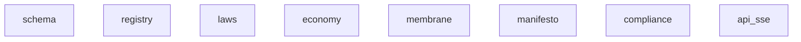

# Repository Map: mind-protocol

*Generated: 2025-12-29 17:51*

- **Files:** 75
- **Directories:** 31
- **Total Size:** 442.2K
- **Doc Files:** 61
- **Code Files:** 13
- **Areas:** 6 (docs/ subfolders)
- **Modules:** 4 (subfolders in areas)
- **DOCS Links:** 13 (1.0 avg per code file)

- markdown: 61
- python: 13



| Module | Code | Docs | Lines | Files | Dependencies |
|--------|------|------|-------|-------|--------------|
| schema | `l4/schema/` | `docs/l4/schema/` | 399 | 5 | - |
| registry | `l4/registry/` | `docs/l4/registry/` | 934 | 5 | - |
| laws | `l4/laws/` | `docs/l4/laws/` | 0 | 2 | - |
| economy | `economy/` | `docs/economy/` | 0 | 11 | - |
| membrane | `None` | `docs/membrane/` | 0 | 0 | - |
| manifesto | `None` | `docs/manifesto/` | 0 | 0 | - |
| compliance | `None` | `docs/compliance/` | 0 | 0 | - |
| api_sse | `api/` | `docs/api/sse/` | 0 | 7 | - |

```
├── api/
│   ├── graphql/
│   │   └── (..3 more files)
│   ├── websocket/
│   │   └── (..4 more files)
│   └── (..1 more files)
├── docs/ (284.2K)
│   ├── api/ (22.2K)
│   │   └── sse/ (22.2K)
│   │       ├── ALGORITHM_SSE_API.md (3.2K)
│   │       ├── BEHAVIORS_SSE_API.md (2.5K)
│   │       ├── HEALTH_SSE_API.md (4.0K)
│   │       ├── IMPLEMENTATION_SSE_API.md (3.7K)
│   │       ├── OBJECTIVES_SSE_API.md (1.2K)
│   │       ├── PATTERNS_SSE_API.md (2.6K)
│   │       ├── SYNC_SSE_API.md (1.3K)
│   │       └── VALIDATION_SSE_API.md (3.7K)
│   ├── compliance/ (4.7K)
│   │   ├── PATTERNS_Compliance.md (4.2K)
│   │   └── SYNC_Compliance.md (539)
│   ├── economy/ (4.5K)
│   │   ├── OBJECTIVES_Economy.md (1.1K)
│   │   ├── PATTERNS_Economy.md (2.5K)
│   │   └── SYNC_Economy.md (918)
│   ├── l4/ (87.1K)
│   │   ├── laws/ (24.7K)
│   │   │   ├── ALGORITHM_Laws.md (3.8K)
│   │   │   ├── BEHAVIORS_Laws.md (3.2K)
│   │   │   ├── HEALTH_Laws.md (4.1K)
│   │   │   ├── IMPLEMENTATION_Laws.md (3.7K)
│   │   │   ├── OBJECTIVES_Laws.md (936)
│   │   │   ├── PATTERNS_Laws.md (3.4K)
│   │   │   ├── SYNC_Laws.md (1.6K)
│   │   │   └── VALIDATION_Laws.md (3.9K)
│   │   ├── registry/ (35.1K)
│   │   │   ├── ALGORITHM_Registry.md (6.8K)
│   │   │   ├── BEHAVIORS_Registry.md (2.5K)
│   │   │   ├── HEALTH_Registry.md (3.3K)
│   │   │   ├── IMPLEMENTATION_Registry.md (5.9K)
│   │   │   ├── OBJECTIVES_Registry.md (1.6K)
│   │   │   ├── PATTERNS_Registry.md (4.6K)
│   │   │   ├── SYNC_Registry.md (5.5K)
│   │   │   ├── VALIDATION_Registry.md (2.8K)
│   │   │   └── VOCABULARY_Registry.md (2.1K)
│   │   ├── schema/ (21.0K)
│   │   │   ├── ALGORITHM_Schema.md (2.8K)
│   │   │   ├── BEHAVIORS_Schema.md (2.3K)
│   │   │   ├── HEALTH_Schema.md (2.9K)
│   │   │   ├── IMPLEMENTATION_Schema.md (2.8K)
│   │   │   ├── OBJECTIVES_Schema.md (1.6K)
│   │   │   ├── PATTERNS_Schema.md (2.7K)
│   │   │   ├── SYNC_Schema.md (3.2K)
│   │   │   └── VALIDATION_Schema.md (2.7K)
│   │   └── PATTERNS_L4.md (6.3K)
│   ├── manifesto/ (3.6K)
│   │   ├── PATTERNS_Manifesto.md (3.1K)
│   │   └── (..1 more files)
│   ├── membrane/ (112.3K)
│   │   ├── ALGORITHM_Membrane_System.md (10.0K)
│   │   ├── HEALTH_Membrane_System.md (12.0K)
│   │   ├── IMPLEMENTATION_Membrane_System.md (12.0K)
│   │   ├── MAPPING_Doctor_Issues_To_Protocols.md (5.6K)
│   │   ├── MAPPING_Issue_Type_Verification.md (15.8K)
│   │   ├── PATTERNS_Membrane_System.md (8.6K)
│   │   ├── SKILLS_AND_PROTOCOLS_Mapping.md (9.9K)
│   │   ├── SYNC_Membrane_System_archive_2025-12.md (9.5K)
│   │   ├── VALIDATION_Completion_Verification.md (11.6K)
│   │   ├── VALIDATION_Membrane_System.md (5.2K)
│   │   └── (..3 more files)
│   ├── ARCHITECTURE.md (4.3K)
│   ├── MAPPING.md (3.6K)
│   ├── TAXONOMY.md (3.7K)
│   └── map.md (38.0K)
├── economy/
│   ├── pricing/
│   │   └── (..2 more files)
│   ├── transactions/
│   │   └── (..4 more files)
│   ├── wallets/
│   │   └── (..4 more files)
│   └── (..1 more files)
├── graph/
│   └── (..3 more files)
├── l4/ (56.1K)
│   ├── laws/
│   │   └── (..2 more files)
│   ├── registry/ (31.4K)
│   │   ├── __init__.py (2.3K) →
│   │   ├── citizen_registration_crud_operations.py (8.2K) →
│   │   ├── endpoint_registration_and_management.py (2.6K) →
│   │   ├── jwt_hash_verification_for_identity.py (11.9K) →
│   │   └── org_registration_crud_operations.py (6.4K) →
│   ├── schema/ (14.6K)
│   │   ├── __init__.py (1.3K) →
│   │   ├── link_base_schema_with_semantic_axes.py (3.3K) →
│   │   ├── node_and_link_schema_validators.py (4.3K) →
│   │   ├── node_type_enum_and_base_pydantic_models.py (3.8K) →
│   │   └── schema_version_tracker_and_compatibility.py (1.9K) →
│   ├── seed/ (10.0K)
│   │   └── l4_protocol_seed_nodes_laws_and_schema.py (10.0K) →
│   └── (..1 more files)
├── skills/ (5.3K)
│   ├── SKILL_register_citizen.md (3.0K)
│   └── SKILL_register_org.md (2.3K)
├── templates/ (640)
│   └── README.md (640)
├── tests/ (34.1K)
│   ├── economy/
│   │   └── (..2 more files)
│   ├── l3/
│   │   └── (..2 more files)
│   ├── l4/ (34.1K)
│   │   ├── test_registry.py (22.0K) →
│   │   ├── test_schema_pydantic_models_and_validators.py (12.1K) →
│   │   └── (..1 more files)
│   └── (..1 more files)
├── .mindignore (838)
├── AGENTS.md (33.0K)
├── ARCHITECTURE.md (1.5K)
├── map.md (38.0K)
└── map_api.md (1.2K)
```

**Sections:**
- # ALGORITHM: SSE API Module
- ## CHAIN:
- ## ALGORITHM: Server-Sent Events (SSE) Stream Generation

**Sections:**
- # BEHAVIORS: SSE API Module
- ## CHAIN:
- ## BEHAVIORS: Server-Sent Event Stream

**Code refs:**
- `route.ts`

**Sections:**
- # HEALTH: SSE API Module
- ## CHAIN:
- ## HEALTH: Server-Sent Events (SSE) Stream Health Monitoring

**Code refs:**
- `Next.js`
- `Node.js`
- `route.ts`

**Sections:**
- # IMPLEMENTATION: SSE API Module
- ## CHAIN:
- ## IMPLEMENTATION: Server-Sent Events (SSE) API Code Architecture

**Sections:**
- # OBJECTIVES: SSE API Module
- ## CHAIN:
- ## OBJECTIVE:
- ## KEY RESULTS:
- ## STAKEHOLDERS:
- ## CONSTRAINTS:
- ## OUT OF SCOPE:

**Code refs:**
- `route.ts`

**Sections:**
- # PATTERNS: SSE API Module
- ## CHAIN:
- ## PATTERN: Server-Sent Events (SSE) Endpoint
- ## RELATED PATTERNS:

**Code refs:**
- `app/api/sse/route.ts`

**Sections:**
- # SYNC: SSE API Module
- ## CHAIN:
- ## CONTEXT:
- ## STATUS: CANONICAL
- ## CHANGES:

**Sections:**
- # VALIDATION: SSE API Module
- ## CHAIN:
- ## VALIDATION: Server-Sent Events (SSE) Stream Validation

**Sections:**
- # PATTERNS: Compliance
- ## What Compliance Means
- ## Compliance Checklist
- ## Compliance Levels
- ## Common Violations
- ## Testing Compliance
- # Example compliance test
- ## Related

**Sections:**
- # SYNC: Compliance
- ## Current State
- ## TODO
- ## Purpose
- ## Related

**Sections:**
- # OBJECTIVES: Economy
- ## Primary Objective
- ## Secondary Objectives
- ## Non-Objectives
- ## Success Criteria

**Code refs:**
- `economy/fees/calculation.py`
- `economy/pricing/physics.py`
- `l4/rules/rules.py`

**Sections:**
- # PATTERNS: Economy
- ## Core Patterns
- ## Organism Economics vs Market
- ## Pricing Formula
- ## Fee Structure
- ## Design Decisions
- ## Non-Objectives
- ## Related

**Code refs:**
- `fees/calculation.py`
- `pricing/physics.py`

**Sections:**
- # SYNC: Economy
- ## Current State
- ## TODO
- ## Handoff
- ## Markers

**Doc refs:**
- `docs/membrane/ALGORITHM_Membrane_System.md`

**Sections:**
- # ALGORITHM: L4 Laws
- ## Law Enforcement Points
- ## Cross-org Stimulus Flow
- # L5: Hash-based identity
- # L2: Register to exist
- # L1: Respect schema
- # L7: Membrane fees
- # L4: Cross-org via membrane
- # L6: Receiver validates
- ## Hash Verification
- ## Fee Calculation
- ## Receiver Validation
- ## WebSocket Enforcement
- ## Related

**Doc refs:**
- `docs/compliance/PATTERNS_Compliance.md`

**Sections:**
- # BEHAVIORS: L4 Laws
- ## What the Laws Do
- ## Observable Effects by Law
- ## Law Violation Responses
- ## Edge Cases
- ## Related

**Doc refs:**
- `docs/compliance/PATTERNS_Compliance.md`

**Sections:**
- # HEALTH: L4 Laws
- ## Health Signals
- ## Health Check Procedures
- # Create test hash
- # Register temporary test citizen
- # Verify
- # Cleanup
- ## Monitoring
- ## Law Violation Alerts
- ## Recovery Actions
- ## Related

**Code refs:**
- `l4/registry/validation.py`

**Sections:**
- # IMPLEMENTATION: L4 Laws
- ## Overview
- ## Directory Structure
- ## Key Files
- # The 8 Laws
- # Fee constraints
- # Schema version
- # L1: Schema
- # L2: Registered
- # L5: Hash identity
- # L7: Fee (if cross-org)
- ## Integration Points
- ## No Code for L3, L4, L8
- ## Related

**Sections:**
- # OBJECTIVES: L4 Laws
- ## Primary Objective
- ## Secondary Objectives
- ## Non-Objectives
- ## Success Criteria

**Sections:**
- # PATTERNS: L4 Laws
- ## What Laws Are
- ## Laws
- ## Law Details
- ## What Devs Can vs Cannot Change
- ## Non-Laws
- ## Related

**Code refs:**
- `ecosystem_law_definitions_and_enforcement.py`
- `l4/seed/l4_protocol_seed_nodes_laws_and_schema.py`

**Sections:**
- # SYNC: L4 Laws
- ## Current State
- ## Doc Chain
- ## Laws Summary
- ## TODO
- ## Handoff
- ## Plan
- ## Markers

**Doc refs:**
- `docs/compliance/PATTERNS_Compliance.md`

**Sections:**
- # VALIDATION: L4 Laws
- ## Critical Invariants
- ## Verification Procedures
- # V5: No raw JWT
- # V6: Valid hash
- ## Compliance Audit
- # Sample recent stimuli
- ## Soft Constraints
- ## Related

**Doc refs:**
- `docs/l4/laws/PATTERNS_Laws.md`

**Sections:**
- # ALGORITHM: L4 Registry
- ## Citizen Registration
- ## Org Registration
- ## Hash Verification
- ## Endpoint Lookup
- ## JWT Handling
- # Never store raw JWT
- # Store a secure hash that can be used for verification
- # This is what gets sent in stimuli
- ## Inbound Stimulus Verification
- ## JWT Signature Verification (Registration)
- ## Complete Registration Flow
- ## Endpoint Location
- ## Related

**Doc refs:**
- `docs/l4/laws/PATTERNS_Laws.md`

**Sections:**
- # BEHAVIORS: L4 Registry
- ## What the Registry Does
- ## Observable Effects
- ## Query Behaviors
- ## Hash Verification Flow
- ## Edge Cases
- ## Related

**Sections:**
- # HEALTH: L4 Registry
- ## Health Signals
- ## Health Check Procedures
- ## Monitoring
- ## Recovery Actions
- ## Audit Log
- ## Related

**Sections:**
- # IMPLEMENTATION: L4 Registry
- ## Architecture
- ## Directory Structure
- ## Key Files
- ## Data Flow: Registration
- ## Data Flow: Hash Verification
- ## Storage
- ## Integration
- ## Dependencies
- ## Related

**Sections:**
- # OBJECTIVES: L4 Registry
- ## Primary Objective
- ## Secondary Objectives
- ## Non-Objectives
- ## Tradeoffs
- ## Success Criteria

**Code refs:**
- `l4/registry/citizen_registration_crud_operations.py`
- `l4/registry/jwt_hash_verification_for_identity.py`
- `l4/registry/org_registration_crud_operations.py`

**Doc refs:**
- `docs/MAPPING.md`
- `docs/TAXONOMY.md`
- `docs/l4/PATTERNS_L4.md`

**Sections:**
- # PATTERNS: L4 Registry
- ## Core L4 Rules
- ## Registry-Specific Patterns
- ## Registry Skills + Procedures
- ## What Gets Registered
- ## Design Decisions
- ## Non-Objectives
- ## Invariants
- ## Related

**Code refs:**
- `citizen_registration_crud_operations.py`
- `endpoint_registration_and_management.py`
- `jwt_hash_verification_for_identity.py`
- `org_registration_crud_operations.py`
- `tests/l4/test_registry.py`

**Doc refs:**
- `docs/MAPPING.md`

**Sections:**
- # SYNC: L4 Registry
- ## Current State
- ## Doc Chain
- ## Recent Changes
- ## TODO
- ## Architecture
- ## Dependencies
- ## Handoff
- ## Plan
- ## Markers

**Doc refs:**
- `docs/l4/laws/PATTERNS_Laws.md`

**Sections:**
- # VALIDATION: L4 Registry
- ## Critical Invariants
- ## Referential Integrity
- ## Verification Procedures
- # V1: Unique citizen IDs
- # V2: Unique org IDs
- # V3: Citizens have valid org
- # V4: Orgs have endpoint
- # V5: Valid WebSocket URLs
- ## Soft Constraints
- ## When Validation Runs
- ## Related

**Doc refs:**
- `docs/MAPPING.md`
- `docs/TAXONOMY.md`

**Sections:**
- # VOCABULARY: L4 Registry
- ## Terms Added to TAXONOMY
- ## Properties (linked nodes)
- ## Relationships
- ## Verification States (computed)
- ## Status Values
- ## Related

**Code refs:**
- `l4/schema/models.py`

**Sections:**
- # ALGORITHM: L4 Schema
- ## Schema Validation Process
- ## Schema Loading
- ## Pydantic Model Generation
- ## Version Checking
- ## Related

**Sections:**
- # BEHAVIORS: L4 Schema
- ## What the Schema Does
- ## Observable Effects
- ## Behavior by Node Type
- ## Edge Cases
- ## Related

**Sections:**
- # HEALTH: L4 Schema
- ## Health Signals
- ## Health Check Procedures
- # Try creating instances
- ## Monitoring
- ## Recovery Actions
- ## Related

**Sections:**
- # IMPLEMENTATION: L4 Schema
- ## Directory Structure
- ## Key Files
- # ... full schema definition
- ## Data Flow
- ## Integration Points
- ## Dependencies
- ## Related

**Sections:**
- # OBJECTIVES: L4 Schema
- ## Primary Objective
- ## Secondary Objectives
- ## Non-Objectives
- ## Tradeoffs
- ## Success Criteria

**Doc refs:**
- `docs/membrane/PATTERNS_Membrane_System.md`

**Sections:**
- # PATTERNS: L4 Schema
- ## Core Patterns
- ## Design Decisions
- ## Non-Objectives
- ## Invariants
- ## Related

**Code refs:**
- `l4/schema/link_base_schema_with_semantic_axes.py`
- `l4/schema/node_type_enum_and_base_pydantic_models.py`
- `link_base_schema_with_semantic_axes.py`
- `link_schema.py`
- `node_and_link_schema_validators.py`
- `node_type_enum_and_base_pydantic_models.py`
- `node_types.py`
- `schema_version_tracker_and_compatibility.py`
- `test_schema.py`
- `test_schema_pydantic_models_and_validators.py`
- `tests/l4/test_schema.py`
- `tests/l4/test_schema_pydantic_models_and_validators.py`
- `validation.py`
- `versions.py`

**Sections:**
- # SYNC: L4 Schema
- ## Current State
- ## Doc Chain
- ## Recent Changes
- ## TODO
- ## Handoff
- ## Plan
- ## Markers

**Sections:**
- # VALIDATION: L4 Schema
- ## Critical Invariants
- ## Derived Invariants
- ## Soft Constraints
- ## Verification Procedures
- # ... etc
- ## When Validation Runs
- ## Related

**Doc refs:**
- `docs/l4/compliance/PATTERNS_Compliance.md`
- `docs/l4/laws/PATTERNS_Laws.md`
- `docs/l4/registry/PATTERNS_Registry.md`

**Sections:**
- # PATTERNS: L4 Protocol
- ## Core Rules
- ## L4-1: L4 = Graph
- ## L4-2: Membrane Only
- ## L4-3: Graph Query Interface
- # READ
- # WRITE
- # UPDATE
- # DELETE
- ## L4-4: Skill + Procedure
- ## Why This Architecture Is Solid
- ## Module-Specific Patterns
- ## Graph Query Interface Reference
- ## Related

**Sections:**
- # PATTERNS: Manifesto
- ## Vision
- ## Core Beliefs
- ## Why This Architecture
- ## What We're Building
- ## Related

**Sections:**
- # ALGORITHM: Membrane System
- ## Doctor Algorithm
- # Membrane executes the protocol
- # Agent answers with skill knowledge in context
- ## Membrane Session Algorithm
- # Check dependencies
- # Validate answer
- # Store answer
- # Create moment for this answer
- # Move to next step
- ## Step Execution Algorithm
- # Multi-case branch
- # Binary branch
- # Push current session onto stack
- # Start sub-protocol with merged context
- ## Protocol Completion Algorithm
- # Top-level protocol complete
- # Pop caller from stack
- # Context preserved (sub-protocol may have added to it)
- ## Cluster Creation Algorithm
- # Create nodes
- # Create links
- # Commit to graph
- ## Query Execution Algorithm
- ## Moment Creation Algorithm
- # Agent provides description/reasoning based on moment_spec.agent_provides
- # Create links
- ## Validation Algorithm
- ## Context Enrichment Algorithm
- # Agent can query graph during any ask step
- ## CHAIN

**Code refs:**
- `mind/connectome/runner.py`

**Sections:**
- # Membrane System — Health: Verification Mechanics and Coverage
- ## WHEN TO USE HEALTH (NOT TESTS)
- ## PURPOSE OF THIS FILE
- ## WHY THIS PATTERN
- ## CHAIN
- ## FLOWS ANALYSIS
- ## HEALTH INDICATORS SELECTED
- ## OBJECTIVES COVERAGE
- ## STATUS (RESULT INDICATOR)
- ## CHECKER INDEX
- ## INDICATOR: h_session_valid
- ## INDICATOR: h_step_ordering
- ## INDICATOR: h_cluster_complete
- ## HOW TO RUN
- # Run all membrane health checks (when implemented)
- # Run specific checker (via tests for now)
- ## KNOWN GAPS
- ## MARKERS

**Code refs:**
- `mind/connectome/runner.py`
- `mind/connectome/session.py`
- `mind/connectome/steps.py`
- `mind/connectome/templates.py`
- `mind/connectome/validation.py`
- `mind/physics/graph.py`
- `test_loader.py`
- `test_runner.py`
- `test_session.py`
- `test_steps.py`
- `test_validation.py`
- `tools/mcp/membrane_server.py`

**Sections:**
- # IMPLEMENTATION: Membrane System
- ## Code Structure
- ## Key Components
- # Doctor loads skill, provides to agent
- # Agent has skill knowledge when answering protocol questions
- ## Data Flow
- ## Configuration
- ## Membrane YAML Location
- ## Protocol YAML (Not Yet Implemented)
- ## Extension Points
- ## Tests
- # Run all connectome tests
- # Current status: 30 passing
- ## CHAIN

**Sections:**
- # Doctor Issues → Protocols Mapping
- ## How It Works
- ## Issue → Protocol → Skill Mapping
- ## Protocol Dependency Graph
- ## Auto-Fix Flow
- # Load skill for context
- # Run protocol via membrane
- ## Issue Detection → Protocol Trigger Examples
- ## Adding New Issue Types

**Code refs:**
- `mind/repair_verification.py`

**Sections:**
- # MAPPING: Issue Type → Verification
- ## CHAIN
- ## QUICK REFERENCE
- ## DETAILED CHECKS
- ## GLOBAL CHECKS (all issue types)
- ## MARKERS

**Sections:**
- # PATTERNS: Membrane System
- ## Core Patterns
- ## Architecture
- ## Skill Format (Markdown)
- # {Skill Name} Skill
- ## Domain
- ## When to Use Which Protocol
- ## Process
- ## Patterns
- ## Anti-Patterns
- ## Queries to Run
- ## Examples
- ## Protocol Format (YAML)
- # ASK - get input from agent
- # type-specific constraints
- # QUERY - load data from graph
- # BRANCH - conditional routing
- # OR for multi-case:
- # CALL_PROTOCOL - invoke sub-protocol
- # CREATE - build cluster
- # fields...
- # fields...
- ## Anti-Patterns
- ## Skills (v1)
- ## Protocols (v1)
- ## Query Language
- ## CHAIN

**Sections:**
- # Skills and Protocols Mapping
- ## Doctor → Skill → Protocol Flow
- ## Skills Inventory
- ## Protocols Inventory
- ## Protocol Dependencies
- ## Doctor → Protocol Mapping Summary
- ## Implementation Priority
- ## Files to Create
- ## CHAIN

**Code refs:**
- `doctor_checks.py`
- `mind/connectome/persistence.py`
- `mind/connectome/schema.py`
- `mind/doctor_checks_membrane.py`
- `mind/repair.py`
- `mind/repair_core.py`
- `mind/repair_verification.py`
- `repair_verification.py`
- `tools/coverage/validate.py`

**Sections:**
- # Archived: SYNC_Membrane_System.md
- ## Maturity
- ## Recent Changes
- # Archived: SYNC_Membrane_System.md
- ## v1.2 Features (Complete)
- # ━━━ ATTRIBUTE EXPLANATIONS ━━━
- # id: "{space_id}"
- # WHAT: Unique identifier
- # WHY: Used in all graph queries
- # FORMAT: space_<area>_<module>
- ## Next Steps

**Code refs:**
- `mind/repair_verification.py`

**Sections:**
- # VALIDATION: Completion Verification System
- ## PURPOSE
- ## CHAIN
- ## ARCHITECTURE
- ## VERIFICATION CHECKS BY ISSUE TYPE
- ## GLOBAL VERIFICATION REQUIREMENTS
- ## AGENT RESTART PROTOCOL
- ## VERIFICATION FAILED
- ## IMPLEMENTATION NOTES
- ## MARKERS

**Sections:**
- # VALIDATION: Membrane System
- ## Protocol Invariants
- ## Membrane Invariants
- ## Session Invariants
- ## Cluster Invariants
- ## Moment Invariants
- ## Query Invariants
- ## Doctor Invariants
- ## v1 Test Cases
- ## Error Conditions
- ## CHAIN

**Sections:**
- # mind-protocol Architecture
- ## Layer Position: L4 (Protocol Law)
- ## Core Responsibilities
- ## Key Invariants
- ## Key Design Decisions
- ## Module Structure
- ## Communication Protocol
- ## Related Repos

**Doc refs:**
- `docs/TAXONOMY.md`

**Sections:**
- # MAPPING: Domain Terms to Schema
- ## Schema Reference
- ## NODE MAPPINGS
- ## LINK MAPPINGS
- ## VERIFICATION STATUS (computed from link)
- ## Related

**Doc refs:**
- `docs/MAPPING.md`

**Sections:**
- # TAXONOMY: Mind Protocol Vocabulary
- ## L4 Registry
- ## L4 Laws
- ## L4 Protocol Nodes (Source of Truth)
- ## Schema
- ## Related

**Code refs:**
- `Next.js`
- `Node.js`
- `app/api/sse/route.ts`
- `citizen_registration_crud_operations.py`
- `doctor_checks.py`
- `doctor_cli_parser_and_run_checker.py`
- `economy/fees/calculation.py`
- `economy/pricing/physics.py`
- `ecosystem_law_definitions_and_enforcement.py`
- `endpoint_registration_and_management.py`
- `fees/calculation.py`
- `jwt_hash_verification_for_identity.py`
- `l4/registry/__init__.py`
- `l4/registry/citizen_registration_crud_operations.py`
- `l4/registry/endpoint_registration_and_management.py`
- `l4/registry/jwt_hash_verification_for_identity.py`
- `l4/registry/org_registration_crud_operations.py`
- `l4/registry/validation.py`
- `l4/rules/rules.py`
- `l4/schema/__init__.py`
- `l4/schema/link_base_schema_with_semantic_axes.py`
- `l4/schema/models.py`
- `l4/schema/node_and_link_schema_validators.py`
- `l4/schema/node_type_enum_and_base_pydantic_models.py`
- `l4/schema/schema_version_tracker_and_compatibility.py`
- `l4/seed/l4_protocol_seed_nodes_laws_and_schema.py`
- `link_base_schema_with_semantic_axes.py`
- `link_schema.py`
- `mind/connectome/persistence.py`
- `mind/connectome/runner.py`
- `mind/connectome/schema.py`
- `mind/connectome/session.py`
- `mind/connectome/steps.py`
- `mind/connectome/templates.py`
- `mind/connectome/validation.py`
- `mind/doctor_checks_membrane.py`
- `mind/physics/graph.py`
- `mind/repair.py`
- `mind/repair_core.py`
- `mind/repair_verification.py`
- `node_and_link_schema_validators.py`
- `node_type_enum_and_base_pydantic_models.py`
- `node_types.py`
- `org_registration_crud_operations.py`
- `pricing/physics.py`
- `repair_verification.py`
- `route.ts`
- `schema_version_tracker_and_compatibility.py`
- `semantic_proximity_based_character_node_selector.py`
- `snake_case.py`
- `test_loader.py`
- `test_runner.py`
- `test_schema.py`
- `test_schema_pydantic_models_and_validators.py`
- `test_session.py`
- `test_steps.py`
- `test_validation.py`
- `tests/l4/test_registry.py`
- `tests/l4/test_schema.py`
- `tests/l4/test_schema_pydantic_models_and_validators.py`
- `tools/coverage/validate.py`
- `tools/mcp/membrane_server.py`
- `validation.py`
- `versions.py`

**Doc refs:**
- `docs/ARCHITECTURE.md`
- `docs/MAPPING.md`
- `docs/TAXONOMY.md`
- `docs/api/sse/ALGORITHM_SSE_API.md`
- `docs/api/sse/BEHAVIORS_SSE_API.md`
- `docs/api/sse/HEALTH_SSE_API.md`
- `docs/api/sse/IMPLEMENTATION_SSE_API.md`
- `docs/api/sse/OBJECTIVES_SSE_API.md`
- `docs/api/sse/PATTERNS_SSE_API.md`
- `docs/api/sse/SYNC_SSE_API.md`
- `docs/api/sse/VALIDATION_SSE_API.md`
- `docs/compliance/PATTERNS_Compliance.md`
- `docs/compliance/SYNC_Compliance.md`
- `docs/economy/OBJECTIVES_Economy.md`
- `docs/economy/PATTERNS_Economy.md`
- `docs/economy/SYNC_Economy.md`
- `docs/l4/PATTERNS_L4.md`
- `docs/l4/compliance/PATTERNS_Compliance.md`
- `docs/l4/laws/ALGORITHM_Laws.md`
- `docs/l4/laws/BEHAVIORS_Laws.md`
- `docs/l4/laws/HEALTH_Laws.md`
- `docs/l4/laws/IMPLEMENTATION_Laws.md`
- `docs/l4/laws/OBJECTIVES_Laws.md`
- `docs/l4/laws/PATTERNS_Laws.md`
- `docs/l4/laws/SYNC_Laws.md`
- `docs/l4/laws/VALIDATION_Laws.md`
- `docs/l4/registry/ALGORITHM_Registry.md`
- `docs/l4/registry/BEHAVIORS_Registry.md`
- `docs/l4/registry/HEALTH_Registry.md`
- `docs/l4/registry/IMPLEMENTATION_Registry.md`
- `docs/l4/registry/OBJECTIVES_Registry.md`
- `docs/l4/registry/PATTERNS_Registry.md`
- `docs/l4/registry/SYNC_Registry.md`
- `docs/l4/registry/VALIDATION_Registry.md`
- `docs/l4/registry/VOCABULARY_Registry.md`
- `docs/l4/schema/ALGORITHM_Schema.md`
- `docs/l4/schema/BEHAVIORS_Schema.md`
- `docs/l4/schema/HEALTH_Schema.md`
- `docs/l4/schema/IMPLEMENTATION_Schema.md`
- `docs/l4/schema/OBJECTIVES_Schema.md`
- `docs/l4/schema/PATTERNS_Schema.md`
- `docs/l4/schema/SYNC_Schema.md`
- `docs/l4/schema/VALIDATION_Schema.md`
- `docs/manifesto/PATTERNS_Manifesto.md`
- `docs/membrane/ALGORITHM_Membrane_System.md`
- `docs/membrane/HEALTH_Membrane_System.md`
- `docs/membrane/IMPLEMENTATION_Membrane_System.md`
- `docs/membrane/MAPPING_Doctor_Issues_To_Protocols.md`
- `docs/membrane/MAPPING_Issue_Type_Verification.md`
- `docs/membrane/PATTERNS_Membrane_System.md`
- `docs/membrane/SKILLS_AND_PROTOCOLS_Mapping.md`
- `docs/membrane/SYNC_Membrane_System_archive_2025-12.md`
- `docs/membrane/VALIDATION_Completion_Verification.md`
- `docs/membrane/VALIDATION_Membrane_System.md`
- `templates/README.md`

**Sections:**
- # Repository Map: mind-protocol

**Docs:** `docs/l4/registry/IMPLEMENTATION_Registry.md`

**Docs:** `docs/l4/registry/IMPLEMENTATION_Registry.md`

**Definitions:**
- `class CitizenRegistration`
- `class CitizenRecord`
- `def generate_citizen_id()`
- `def hash_jwt()`
- `def create_citizen_nodes()`
- `def citizen_to_record()`

**Docs:** `docs/l4/registry/IMPLEMENTATION_Registry.md`

**Definitions:**
- `class EndpointValidationResult`
- `def success()`
- `def failure()`
- `def validate_endpoint_url()`
- `def create_endpoint_node()`
- `def update_endpoint_url()`

**Docs:** `docs/l4/registry/IMPLEMENTATION_Registry.md`

**Definitions:**
- `class VerificationStatus`
- `class VerificationResult`
- `def is_valid()`
- `def compute_hash()`
- `def verify_hash()`
- `def create_verification_hash()`
- `class JWTVerificationStatus`
- `class JWTVerificationResult`
- `def is_valid()`
- `def decode_jwt_parts()`
- `def verify_jwt_claims()`
- `def verify_jwt_signature()`
- `class RoutingVerificationResult`
- `def is_valid()`
- `def can_route()`
- `def verify_and_get_endpoint()`

**Docs:** `docs/l4/registry/IMPLEMENTATION_Registry.md`

**Definitions:**
- `class OrgRegistration`
- `class OrgRecord`
- `def generate_org_id()`
- `def create_org_nodes()`
- `def org_to_record()`

**Docs:** `docs/l4/schema/IMPLEMENTATION_Schema.md`

**Docs:** `docs/l4/schema/IMPLEMENTATION_Schema.md`

**Definitions:**
- `class LinkBase`
- `def validate_polarity()`
- `def validate_embedding_dimensions()`
- `def forward_coloration_weight()`
- `def emotions()`

**Docs:** `docs/l4/schema/IMPLEMENTATION_Schema.md`

**Definitions:**
- `class ValidationResult`
- `def success()`
- `def failure()`
- `def validate_node()`
- `def validate_link()`
- `def validate_graph()`
- `def check_invariants()`

**Docs:** `docs/l4/schema/IMPLEMENTATION_Schema.md`

**Definitions:**
- `class NodeType`
- `class MomentStatus`
- `class NodeBase`
- `def validate_embedding_dimensions()`
- `class MomentBase`
- `def duration_s()`
- `class ActorNode`
- `class NarrativeNode`
- `class SpaceNode`
- `class ThingNode`

**Docs:** `docs/l4/schema/IMPLEMENTATION_Schema.md`

**Definitions:**
- `class VersionCompatibility`
- `class VersionInfo`
- `def parse()`
- `def __str__()`
- `def check_version_compatibility()`
- `def get_schema_version()`
- `def get_protocol_version()`

**Docs:** `docs/l4/laws/PATTERNS_Laws.md`

**Definitions:**
- `def get_protocol_seed_data()`

**Sections:**
- # Skill: Register Citizen
- ## Purpose
- ## Inputs
- ## Outputs
- ## Graph Result
- ## Example
- # Input
- # Output
- ## Validation
- ## Errors
- ## Identity Hash
- ## Related

**Sections:**
- # Skill: Register Org
- ## Purpose
- ## Inputs
- ## Outputs
- ## Graph Result
- ## Example
- # Input
- # Output
- ## Validation
- ## Errors
- ## Related

**Sections:**
- # Mind Protocol Templates
- ## Usage
- ## Contents
- ## Versioning

**Docs:** `docs/l4/registry/VALIDATION_Registry.md`

**Definitions:**
- `def make_test_jwt()`
- `def b64encode()`
- `class TestCitizenRegistration`
- `def test_generate_citizen_id_format()`
- `def test_generate_citizen_id_unique()`
- `def test_hash_jwt()`
- `def test_create_citizen_nodes_basic()`
- `def test_create_citizen_nodes_with_wallet()`
- `def test_create_citizen_nodes_with_capabilities()`
- `def test_create_citizen_with_custom_id()`
- `def test_identity_hash_deterministic()`
- `def test_identity_hash_different_for_different_ids()`
- `class TestOrgRegistration`
- `def test_generate_org_id_format()`
- `def test_generate_org_id_unique()`
- `def test_create_org_nodes_basic()`
- `def test_org_node_is_space_type()`
- `class TestEndpointValidation`
- `def test_valid_wss_url()`
- `def test_valid_wss_url_with_port()`
- `def test_invalid_ws_url()`
- `def test_invalid_http_url()`
- `def test_empty_url()`
- `def test_create_endpoint_node_valid()`
- `def test_create_endpoint_node_invalid()`
- `class TestHashVerification`
- `def test_compute_hash_deterministic()`
- `def test_compute_hash_different_inputs()`
- `def test_compute_hash_length()`
- `def test_create_verification_hash()`
- `def test_verify_hash_not_found()`
- `def lookup()`
- `def test_verify_hash_valid()`
- `def lookup()`
- `def test_verify_hash_invalid()`
- `def lookup()`
- `def test_verify_hash_suspended()`
- `def lookup()`
- `class TestVerificationResult`
- `def test_is_valid_property()`
- `class TestLinkProperties`
- `def test_citizen_link_hierarchy()`
- `def test_immutable_properties_have_high_permanence()`
- `def test_mutable_properties_have_lower_permanence()`
- `class TestJWTDecoding`
- `def test_decode_valid_jwt()`
- `def test_decode_invalid_jwt_format()`
- `def test_decode_jwt_missing_parts()`
- `class TestJWTClaimsVerification`
- `def test_valid_claims()`
- `def test_expired_jwt()`
- `def test_not_yet_valid_jwt()`
- `def test_wrong_issuer()`
- `class TestJWTSignatureVerification`
- `def test_verify_jwt_org_not_found()`
- `def lookup()`
- `def test_verify_jwt_missing_public_key()`
- `def lookup()`
- `def test_verify_jwt_valid_format()`
- `def lookup()`
- `def test_verify_jwt_invalid_format()`
- `def lookup()`
- `def test_verify_jwt_expired()`
- `def lookup()`
- `class TestRoutingVerification`
- `def test_verify_and_get_endpoint_success()`
- `def lookup()`
- `def test_verify_and_get_endpoint_sender_not_found()`
- `def lookup()`
- `def test_verify_and_get_endpoint_hash_mismatch()`
- `def lookup()`
- `def test_verify_and_get_endpoint_sender_suspended()`
- `def lookup()`
- `def test_verify_and_get_endpoint_no_dest_endpoint()`
- `def lookup()`

**Docs:** `docs/l4/schema/HEALTH_Schema.md`

**Definitions:**
- `class TestNodeTypes`
- `def test_node_type_values()`
- `def test_moment_status_values()`
- `class TestNodeBase`
- `def test_create_valid_node()`
- `def test_weight_must_be_non_negative()`
- `def test_energy_must_be_non_negative()`
- `def test_embedding_must_be_1536_dims()`
- `def test_no_custom_fields()`
- `def test_subtype_is_optional()`
- `class TestMomentBase`
- `def test_moment_has_status()`
- `def test_moment_duration_computed()`
- `def test_moment_duration_none_if_incomplete()`
- `class TestSpecificNodeTypes`
- `def test_actor_node()`
- `def test_narrative_node()`
- `def test_space_node()`
- `def test_thing_node()`
- `class TestLinkBase`
- `def test_create_valid_link()`
- `def test_polarity_must_be_in_range()`
- `def test_hierarchy_must_be_in_range()`
- `def test_permanence_must_be_in_range()`
- `def test_emotions_in_range()`
- `def test_forward_coloration_weight()`
- `def test_emotions_property()`
- `class TestValidation`
- `def test_validate_valid_node()`
- `def test_validate_invalid_node()`
- `def test_validate_valid_link()`
- `def test_validate_invalid_link()`
- `def test_validate_graph_reference_integrity()`
- `class TestVersions`
- `def test_schema_version_format()`
- `def test_version_compatibility_exact()`
- `def test_version_compatibility_minor_diff()`
- `def test_version_compatibility_major_diff()`
- `class TestInvariants`
- `def test_check_negative_weight()`
- `def test_check_negative_energy()`
- `def test_check_hierarchy_out_of_range()`

**Code refs:**
- `doctor_cli_parser_and_run_checker.py`
- `semantic_proximity_based_character_node_selector.py`
- `snake_case.py`

**Sections:**
- # mind-protocol - Agent Instructions
- # Working Principles
- ## Architecture: One Solution Per Problem
- ## Verification: Test Before Claiming Built
- ## Communication: Depth Over Brevity
- ## Quality: Never Degrade
- ## Code Discipline: No Safety Theater
- ## Experience: User Before Infrastructure
- ## Doc Chain First: Read Before Acting
- ## Feedback Loop: Human-Agent Collaboration
- ## How These Principles Integrate
- # mind Framework
- ## WHY THIS PROTOCOL EXISTS
- ## ARCHITECTURE: 4 LAYERS
- ## COMPANION: PRINCIPLES.md
- ## THE CORE INSIGHT
- ## HOW TO USE THIS
- ## FILE TYPES AND THEIR PURPOSE
- ## KEY PRINCIPLES (from PRINCIPLES.md)
- ## STRUCTURING YOUR DOCS
- ## WHEN DOCS DON'T EXIST
- ## THE DOCUMENTATION PROCESS
- ## Maturity
- ## NAMING ENGINEERING PRINCIPLES
- ## MARKERS
- ## CLI COMMANDS
- # Run scripts with local runtime
- # my_script.py - imports work normally
- ## MCP MEMBRANE TOOLS
- ## MIND UNIVERSAL SCHEMA
- ## THE PROTOCOL IS A TOOL
- ## Before Any Task
- ## After Any Change

**Sections:**
- # Mind Protocol — Architecture
- ## Layers
- ## Structure
- ## Communication
- ## Economy
- ## Key Invariants
- ## Related

**Code refs:**
- `Next.js`
- `Node.js`
- `app/api/sse/route.ts`
- `citizen_registration_crud_operations.py`
- `doctor_checks.py`
- `doctor_cli_parser_and_run_checker.py`
- `economy/fees/calculation.py`
- `economy/pricing/physics.py`
- `ecosystem_law_definitions_and_enforcement.py`
- `endpoint_registration_and_management.py`
- `fees/calculation.py`
- `jwt_hash_verification_for_identity.py`
- `l4/registry/__init__.py`
- `l4/registry/citizen_registration_crud_operations.py`
- `l4/registry/endpoint_registration_and_management.py`
- `l4/registry/jwt_hash_verification_for_identity.py`
- `l4/registry/org_registration_crud_operations.py`
- `l4/registry/validation.py`
- `l4/rules/rules.py`
- `l4/schema/__init__.py`
- `l4/schema/link_base_schema_with_semantic_axes.py`
- `l4/schema/models.py`
- `l4/schema/node_and_link_schema_validators.py`
- `l4/schema/node_type_enum_and_base_pydantic_models.py`
- `l4/schema/schema_version_tracker_and_compatibility.py`
- `l4/seed/l4_protocol_seed_nodes_laws_and_schema.py`
- `link_base_schema_with_semantic_axes.py`
- `link_schema.py`
- `mind/connectome/persistence.py`
- `mind/connectome/runner.py`
- `mind/connectome/schema.py`
- `mind/connectome/session.py`
- `mind/connectome/steps.py`
- `mind/connectome/templates.py`
- `mind/connectome/validation.py`
- `mind/doctor_checks_membrane.py`
- `mind/physics/graph.py`
- `mind/repair.py`
- `mind/repair_core.py`
- `mind/repair_verification.py`
- `node_and_link_schema_validators.py`
- `node_type_enum_and_base_pydantic_models.py`
- `node_types.py`
- `org_registration_crud_operations.py`
- `pricing/physics.py`
- `repair_verification.py`
- `route.ts`
- `schema_version_tracker_and_compatibility.py`
- `semantic_proximity_based_character_node_selector.py`
- `snake_case.py`
- `test_loader.py`
- `test_runner.py`
- `test_schema.py`
- `test_schema_pydantic_models_and_validators.py`
- `test_session.py`
- `test_steps.py`
- `test_validation.py`
- `tests/l4/test_registry.py`
- `tests/l4/test_schema.py`
- `tests/l4/test_schema_pydantic_models_and_validators.py`
- `tools/coverage/validate.py`
- `tools/mcp/membrane_server.py`
- `validation.py`
- `versions.py`

**Doc refs:**
- `docs/ARCHITECTURE.md`
- `docs/MAPPING.md`
- `docs/TAXONOMY.md`
- `docs/api/sse/ALGORITHM_SSE_API.md`
- `docs/api/sse/BEHAVIORS_SSE_API.md`
- `docs/api/sse/HEALTH_SSE_API.md`
- `docs/api/sse/IMPLEMENTATION_SSE_API.md`
- `docs/api/sse/OBJECTIVES_SSE_API.md`
- `docs/api/sse/PATTERNS_SSE_API.md`
- `docs/api/sse/SYNC_SSE_API.md`
- `docs/api/sse/VALIDATION_SSE_API.md`
- `docs/compliance/PATTERNS_Compliance.md`
- `docs/compliance/SYNC_Compliance.md`
- `docs/economy/OBJECTIVES_Economy.md`
- `docs/economy/PATTERNS_Economy.md`
- `docs/economy/SYNC_Economy.md`
- `docs/l4/PATTERNS_L4.md`
- `docs/l4/compliance/PATTERNS_Compliance.md`
- `docs/l4/laws/ALGORITHM_Laws.md`
- `docs/l4/laws/BEHAVIORS_Laws.md`
- `docs/l4/laws/HEALTH_Laws.md`
- `docs/l4/laws/IMPLEMENTATION_Laws.md`
- `docs/l4/laws/OBJECTIVES_Laws.md`
- `docs/l4/laws/PATTERNS_Laws.md`
- `docs/l4/laws/SYNC_Laws.md`
- `docs/l4/laws/VALIDATION_Laws.md`
- `docs/l4/registry/ALGORITHM_Registry.md`
- `docs/l4/registry/BEHAVIORS_Registry.md`
- `docs/l4/registry/HEALTH_Registry.md`
- `docs/l4/registry/IMPLEMENTATION_Registry.md`
- `docs/l4/registry/OBJECTIVES_Registry.md`
- `docs/l4/registry/PATTERNS_Registry.md`
- `docs/l4/registry/SYNC_Registry.md`
- `docs/l4/registry/VALIDATION_Registry.md`
- `docs/l4/registry/VOCABULARY_Registry.md`
- `docs/l4/schema/ALGORITHM_Schema.md`
- `docs/l4/schema/BEHAVIORS_Schema.md`
- `docs/l4/schema/HEALTH_Schema.md`
- `docs/l4/schema/IMPLEMENTATION_Schema.md`
- `docs/l4/schema/OBJECTIVES_Schema.md`
- `docs/l4/schema/PATTERNS_Schema.md`
- `docs/l4/schema/SYNC_Schema.md`
- `docs/l4/schema/VALIDATION_Schema.md`
- `docs/manifesto/PATTERNS_Manifesto.md`
- `docs/membrane/ALGORITHM_Membrane_System.md`
- `docs/membrane/HEALTH_Membrane_System.md`
- `docs/membrane/IMPLEMENTATION_Membrane_System.md`
- `docs/membrane/MAPPING_Doctor_Issues_To_Protocols.md`
- `docs/membrane/MAPPING_Issue_Type_Verification.md`
- `docs/membrane/PATTERNS_Membrane_System.md`
- `docs/membrane/SKILLS_AND_PROTOCOLS_Mapping.md`
- `docs/membrane/SYNC_Membrane_System_archive_2025-12.md`
- `docs/membrane/VALIDATION_Completion_Verification.md`
- `docs/membrane/VALIDATION_Membrane_System.md`
- `templates/README.md`

**Sections:**
- # Repository Map: mind-protocol

**Sections:**
- # Repository Map: mind-protocol/api
- ## Statistics
- ## Module Dependencies
- ## File Tree
- ## File Details
