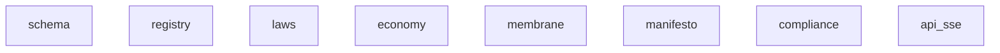

# Repository Map: mind-protocol/api

*Generated: 2026-03-14 17:10*

## Statistics

- **Files:** 0
- **Directories:** 3
- **Total Size:** 0
- **Doc Files:** 0
- **Code Files:** 0
- **Areas:** 12 (docs/ subfolders)
- **Modules:** 33 (subfolders in areas)
- **DOCS Links:** 0 (0 avg per code file)

## Module Dependencies



### Module Details

| Module | Code | Docs | Lines | Files | Dependencies |
|--------|------|------|-------|-------|--------------|
| schema | `l4/schema/` | `docs/l4/schema/` | 384 | 5 | - |
| registry | `l4/registry/` | `docs/l4/registry/` | 3024 | 12 | - |
| laws | `l4/laws/` | `docs/l4/laws/` | 238 | 4 | - |
| economy | `economy/` | `docs/economy/` | 3455 | 31 | - |
| membrane | `None` | `docs/membrane/` | 0 | 0 | - |
| manifesto | `None` | `docs/manifesto/` | 0 | 0 | - |
| compliance | `None` | `docs/compliance/` | 0 | 0 | - |
| api_sse | `api/` | `docs/api/sse/` | 0 | 7 | - |

## File Tree

```
├── graphql/
│   └── (..3 more files)
└── websocket/
    └── (..4 more files)
```

## File Details
